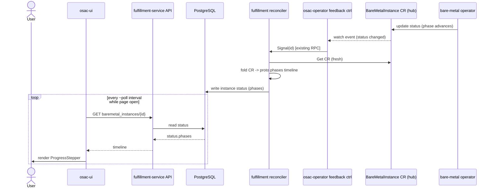
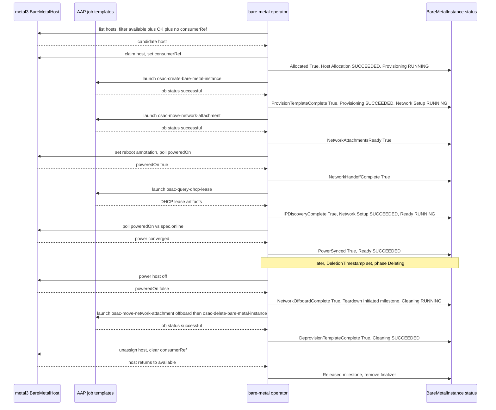

# BMaaS Provisioning Progress and Step Visibility

## Summary

This design adds a persisted, ordered, per-phase progress timeline to bare metal
instances, exposed through the fulfillment-service API and rendered as a
read-only PatternFly `ProgressStepper` on the instance detail view. The
`BareMetalInstance` CRD and fulfillment proto gain an embedded `phases` timeline
(four provisioning phases, three deprovisioning phases) carrying each phase's
state and a single transition timestamp — the moment the phase became active —
from which the UI derives per-phase durations; the fulfillment reconciler
derives the timeline from the CR, and the DB copy is kept fresh within seconds by
the existing osac-operator feedback→`Signal` path (no new watch). See
[PRD](prd.md) for detailed requirements.

## Motivation

Today a bare metal instance shows only a coarse lifecycle badge (`PROVISIONING`,
`READY`, `FAILED`) plus a raw conditions table in the UI. The fulfillment
reconciler that derives the instance's API status reads only two of the nine
CRD conditions and sets the `PROVISIONED` condition as a binary ratchet with an
empty reason [Codebase: fulfillment-service/internal/controllers/baremetalinstance/baremetalinstance_reconciler_function.go]
— so the largely sequential provisioning signal the operator already tracks
(host allocation, the provisioning job, network handoff, and readiness) is
discarded before it reaches the API. When a deployment stalls or fails, the user
cannot tell which step is running or where it stopped, and the same opacity
applies to deprovisioning.

Three implementation-level facts shape this design. First, bare-metal
provisioning is driven by a single opaque AAP job
(`osac-create-bare-metal-instance`), not by separable metal3/Ironic states — the
metal3 `BareMetalHost` is inventory and power management only and exposes no
observable per-step provisioning signal [Research: loop-back Domain 7]. Hardware
preparation, OS deployment, and configuration therefore all happen inside that
one job and cannot be independently observed; they collapse into a single
**Provisioning** phase. Only Host Allocation, Network Setup, and Ready are
independently observable (via osac-operator conditions/signals). Second, the
DB↔hub freshness path already exists: the osac-operator feedback controller
already watches the hub CRs and rings fulfillment via a `Signal(id)` RPC on
status change, and the fulfillment reconciler already re-reads the CR and updates
the DB within seconds — so no new watch is needed, only an extension of what the
`Signal` fires on and of the reconciler's field mapping [Research: loop-back
Domain 8]. Third, a single cycling status
condition (the shipped VMaaS shape) retains only the *current* sub-step and its
`lastTransitionTime` — it loses the ordered history of prior phases as the reason
advances, so it cannot present the full completed timeline the PRD requires
[PRD: In Scope; Assumptions]. (A single transition timestamp per phase is,
however, sufficient to convey timing — see the design decision below.)

This design closes all three gaps while keeping the cross-service progress
experience consistent with VMaaS (OSAC-1027) and CaaS (OSAC-1604).

### Goals

- Reuse the OSAC status pattern: retain the existing lifecycle `state` and
  `conditions`, and express the current sub-step as a condition reason, so the
  shared status label and conditions table stay consistent across services
  [PRD: In Scope; Locked pattern reuse].
- Represent per-phase state and a single transition timestamp as an embedded,
  ordered timeline field on `BareMetalInstanceStatus` — not a separate CRD or DB
  table — keeping the model consistent with how every OSAC resource carries its
  status, and letting the UI derive each phase's duration from consecutive
  transition timestamps [Research: dedicated-object analysis].
- Persist the completed timeline in the fulfillment DB so it survives CR
  deletion and remains viewable for the life of the fulfillment instance record
  (until the record is archived on finalizer removal), with no new persistence
  subsystem.
- Reuse the existing osac-operator feedback→`Signal` freshness path so status
  reflects backend changes within seconds during and after active phases — no new
  hub-side watch is introduced.
- Introduce a single reusable read-only `ProgressStepper` UI keyed off the new
  timeline field, usable later by VMaaS/CaaS without a model change.

### Non-Goals

- No user-initiated actions on the progress view: no retry, re-provision, or any
  mutating control [PRD: Out of Scope].
- No changes to the metal3/Ironic provisioning automation or AAP playbook logic;
  this design only observes and surfaces existing backend signals
  [PRD: Out of Scope].
- No per-phase log or command output; the timeline carries phase name, state,
  timestamps, and a human-readable message only [PRD: Out of Scope].
- No cross-tenant aggregated list of in-progress instances; users reach
  instances through existing navigation [PRD: Out of Scope].
- No progress model changes for VMaaS or CaaS in this feature, though the new
  field and UI component are designed to be reusable by them [PRD: Out of Scope].

## Proposal

The change spans three components in dependency order:

1. **fulfillment-service proto** gains a `repeated BareMetalInstancePhaseProgress
   phases` field on `BareMetalInstanceStatus`, plus two enums:
   `BareMetalInstancePhase` (the seven user-facing phases) and
   `BareMetalInstancePhaseState` (`PENDING`, `RUNNING`, `SUCCEEDED`, `FAILED`,
   `SKIPPED`). Each entry carries `phase`, `state`, `last_transition_time`, and
   `message`.

2. **bare-metal-fulfillment-operator** adds a matching
   `ProvisioningProgress []PhaseProgress` field to `BareMetalInstanceStatus` and
   populates it during reconciliation by folding its own lifecycle conditions and
   AAP job status into the ordered phase timeline, recording each phase's
   transition timestamp (the moment it became active) itself — the metal3
   `BareMetalHost` exposes no per-step provisioning signal and the AAP
   `JobStatus.Timestamp` is trigger-only, so the operator is the authoritative
   source of every transition timestamp.

3. **fulfillment-service reconciler** maps the CR timeline into the proto
   `phases` field (and sets the current sub-step reason on the existing
   `PROVISIONED` condition). Freshness reuses the existing osac-operator
   feedback→`Signal` path: the feedback controller's `Signal(id)` trigger is
   extended to fire when the `phases` timeline changes, and the reconciler's
   `syncStatus()` mapping is extended to carry the new field. No new watch or
   informer is added.

4. **osac-ui** adds a read-only `BareMetalProgressStepper` component to the
   instance detail view, rendering the `phases` timeline as a vertical
   PatternFly `ProgressStepper` that auto-refreshes and remains available for
   completed and failed instances (and for released instances until their record
   is archived).

The timeline is the single authoritative representation of per-phase progress;
the conditions/reason layer is retained only for coarse-status consistency with
other services. Because the fulfillment DB already stores the instance's proto
status as JSON, the timeline persists across CR deletion with no new storage.

**Design decision — one transition timestamp per phase, not start + end
`[User]`.** The PRD's In Scope lists "start and end timestamps" per phase. This
design deliberately records a *single* `last_transition_time` per phase — the
moment the phase became active — rather than a separate start and end. Because the
user-facing timeline is strictly sequential and contiguous (overlapping backend
work is collapsed into one ordered sequence, see the phase mapping below), a
phase's end is exactly the next phase's `last_transition_time`, and its duration is
the difference between consecutive transition timestamps; the final phase's end
and a failed phase's fail-instant are already carried by the coarse lifecycle
`state`/condition `lastTransitionTime`. No information is therefore lost relative
to explicit start+end, the UI can still show per-phase durations, and the shape
matches the shipped VMaaS `metav1.Condition` (one `lastTransitionTime` per
transition) more closely. This challenges the PRD's literal "start and end"
wording while satisfying its intent; the PRD should be reconciled to "a
transition timestamp per phase (duration derived)" on its next revision.

### Workflow Description

Actors: **Tenant User**, **Tenant Admin**, and **Cloud Provider Admin** — all
have the same read-only view of an instance they can already see.

Starting state: a bare metal instance has been ordered and its
`BareMetalInstance` CR exists on the hub.

1. The user opens the instance detail page in the console. The page issues a
   `GET /api/fulfillment/v1/baremetal_instances/{id}` and renders the
   `status.phases` timeline as a vertical stepper: Host Allocation →
   Provisioning → Network Setup → Ready (or, during deletion, Teardown
   Initiated → Cleaning → Released).
2. Each step shows its state (pending, running with a spinner, succeeded, or
   failed) and the time it became active; the UI derives each finished step's
   duration from the next step's transition time (and the running step's elapsed
   time from now).
3. While the instance is active, the detail query re-fetches on the global
   ~10s polling interval; the operator updates the CR, the osac-operator feedback
   controller signals fulfillment, which re-syncs the DB within seconds, and the
   next poll shows the advanced timeline without any user action.
4. On failure, the failing step renders in the danger variant with a
   phase-specific, human-readable message (for example, "Provisioning failed —
   the host could not be provisioned; contact support if this persists."); no raw
   internal error is shown, and no retry control is offered.
5. When provisioning completes, all four steps show succeeded with their derived
   durations; the timeline remains rendered and refetching stops advancing it.
6. When the user deletes the instance, the stepper switches to the three
   deprovisioning phases and tracks teardown to Released.
7. After the instance is released and its CR removed, the detail view continues
   to serve the final persisted timeline from the fulfillment DB until the
   instance record is archived on finalizer removal, after which the public
   `GET` returns 404 as for any released instance (see Persistence and
   retention).



This diagram shows the freshness path the design reuses — the existing
osac-operator feedback controller → `Signal(id)` → reconciler re-read → DB write
— and the unchanged UI polling path. The key takeaway: the operator's CR updates
already reach the DB within seconds via this path; this design only extends what
the `Signal` fires on (the `phases` timeline) and the reconciler's field mapping.
Source-side freshness is therefore bounded by the existing feedback path
(seconds), so the global ~10s UI poll is sufficient to satisfy the PRD's
"approximately every 5 seconds" auto-refresh — which is a soft target, not a firm
latency SLA `[User]` — without a bespoke per-page refetch interval.

### API Extensions

This enhancement modifies the fulfillment-service `BareMetalInstances` API
surface and the `BareMetalInstance` CRD. It does not add new gRPC services,
webhooks, or aggregated API servers. It does not read or modify resources owned
by other teams (in particular, it does not depend on metal3 CRD internals — the
timeline is derived from osac-operator lifecycle conditions and AAP job status).

The concrete interface changes (referenced by the testplan as IC-N):

- **IC-1 — Proto `phases` field.** Add `repeated BareMetalInstancePhaseProgress
  phases` to `BareMetalInstanceStatus` in both the private and public protos,
  with new enums `BareMetalInstancePhase` and
  `BareMetalInstancePhaseState`. Regenerated via `buf lint && buf generate`.
  Requirements: FR-1, FR-2.
- **IC-2 — CRD `ProvisioningProgress` field.** Add `ProvisioningProgress
  []PhaseProgress` to `BareMetalInstanceStatus` in the operator, with operator
  logic that populates the ordered timeline from backend signals. Requirements:
  FR-1, FR-2, FR-4.
- **IC-3 — Reconciler timeline sync.** Extend the fulfillment reconciler's
  `syncStatus()` to map the CR timeline into the proto `phases` field and set the
  current-step reason on the `PROVISIONED` condition. Requirements: FR-1, FR-4,
  FR-5.
- **IC-4 — Extend the existing feedback→`Signal` freshness path.** Extend the
  osac-operator feedback controller's `Signal(id)` trigger to fire when the
  `phases` timeline changes (today it already fires on other status changes), so
  the fulfillment reconciler re-syncs the DB within seconds. No new watch or
  informer is added. Requirements: NFR-1.
- **IC-5 — UI progress stepper.** Add the read-only `BareMetalProgressStepper`
  to the instance detail view, consuming `status.phases`, auto-refreshing, with
  an `aria-live` region. Requirements: FR-1, FR-2, FR-3, FR-4, FR-5, NFR-2.
- **IC-6 — Failure message vocabulary.** Define the per-phase human-readable
  failure messages the operator/reconciler write into `phases[].message`.
  Requirements: FR-5.

Operational impact: if the operator is down, the timeline stops advancing but
the last-synced state remains served from the DB. If the fulfillment reconciler
is down, the DB is not refreshed; the API serves the last-known timeline and
resumes on restart (the reconciler re-syncs via its existing full-resync path).
If the feedback→`Signal` path is disrupted, the design degrades to the existing
periodic full resync (correctness preserved, freshness reduced) rather than
losing data.

## UX Alignment

The `@temp-api` file `osac-ux/libs/ui-components/src/api/v1/baremetal-instance.ts`
exists but exposes no per-phase progress fields today — the instance type is
imported from generated protobuf types (there is no hand-written `@temp-api`
status type) and its status carries the existing coarse fields (`state`,
`conditions`, and the other current status fields) but no per-phase progress.
This EP introduces the fields the UI will consume; after the backend ships and
`pnpm gen-types` runs (which regenerates the types from the rebuilt protos), the
migration diff should be limited to adding the timeline field below.

| UI field (`@temp-api` TypeScript) | Proto field (this EP) | Notes / deviation |
|---|---|---|
| `status.phases[].phase` | `status.phases[].phase` | New. Enum `BareMetalInstancePhase` (field `phase`, mirroring `IdentityProviderStatus.phase`); UI renders the display label per phase |
| `status.phases[].state` | `status.phases[].state` | New. Enum `BareMetalInstancePhaseState` → PatternFly step variant |
| `status.phases[].lastTransitionTime` | `status.phases[].last_transition_time` | New. camelCase → snake_case. When the phase became active; UI derives duration from the next phase's value |
| `status.phases[].message` | `status.phases[].message` | New. Human-readable failure/status text; empty on success |
| `status.state` | `status.state` | Unchanged; still drives the coarse status label |
| `status.conditions` | `status.conditions` | Unchanged; retained for the shared conditions table |

No known anti-patterns apply: `phases` is a status (read-only, observed-state)
field, not a sub-resource action, string-union storage class, K8s-internal
field, one-time secret, or RHOAI operator field.

### Implementation Details/Notes/Constraints

#### Proto schema

```proto
enum BareMetalInstancePhase {
  BARE_METAL_INSTANCE_PHASE_UNSPECIFIED = 0;
  // Provisioning — Provisioning covers OS install + configuration, which run in
  // a single opaque AAP job and are not independently observable.
  BARE_METAL_INSTANCE_PHASE_HOST_ALLOCATION = 1;
  BARE_METAL_INSTANCE_PHASE_PROVISIONING = 2;
  BARE_METAL_INSTANCE_PHASE_NETWORK_SETUP = 3;
  BARE_METAL_INSTANCE_PHASE_READY = 4;
  // Deprovisioning
  BARE_METAL_INSTANCE_PHASE_TEARDOWN_INITIATED = 5;
  BARE_METAL_INSTANCE_PHASE_CLEANING = 6;
  BARE_METAL_INSTANCE_PHASE_RELEASED = 7;
}

enum BareMetalInstancePhaseState {
  BARE_METAL_INSTANCE_PHASE_STATE_UNSPECIFIED = 0;
  BARE_METAL_INSTANCE_PHASE_STATE_PENDING = 1;
  BARE_METAL_INSTANCE_PHASE_STATE_RUNNING = 2;
  BARE_METAL_INSTANCE_PHASE_STATE_SUCCEEDED = 3;
  BARE_METAL_INSTANCE_PHASE_STATE_FAILED = 4;
  BARE_METAL_INSTANCE_PHASE_STATE_SKIPPED = 5;
}

message BareMetalInstancePhaseProgress {
  BareMetalInstancePhase phase = 1;                    // which phase (matches IdentityProviderStatus.phase precedent)
  BareMetalInstancePhaseState state = 2;               // the phase's progress state
  google.protobuf.Timestamp last_transition_time = 3;  // when the phase became active; duration derived from the next phase
  optional string message = 4;                         // human-readable; populated on failure
}
```

`phases` is added to `BareMetalInstanceStatus` alongside the existing `state` and
`conditions` [Codebase: fulfillment-service/proto/private/osac/private/v1/baremetal_instance_type.proto].
The list is ordered by the phase sequence for the active direction
(provisioning or deprovisioning). The current sub-step is derivable as the entry
whose `state == RUNNING`; the reconciler also mirrors that phase name into the
`PROVISIONED` condition's `reason` so the coarse label and conditions table stay
consistent with VMaaS [Codebase: osac-operator/api/v1alpha1/conditions.go].

**Naming conventions and precedent (verified against the shipped protos).** The
new identifiers follow the documented OSAC proto conventions
[Codebase: fulfillment-service/docs/API.md:378-397]: CamelCase enum type names,
values prefixed with the full enum-type name in `UPPER_SNAKE_CASE`, and
`_UNSPECIFIED = 0` first. Field names mirror the closest existing precedents: the
`phase` field and `BareMetalInstancePhase` enum follow the only phase precedent in
the tree, `IdentityProviderStatus.phase` / `IdentityProviderPhase`
[Codebase: fulfillment-service/proto/private/osac/private/v1/identity_provider_type.proto];
`last_transition_time` and `optional string message` match the shared condition
shape used by every resource (`ComputeInstanceCondition`, `ClusterCondition`,
`BareMetalInstanceCondition`, each `google.protobuf.Timestamp last_transition_time`
+ `optional string message`) and the K8s `metav1.Condition`. Note the scope of the
"cross-service consistency" claim: **VMaaS (`ComputeInstanceStatus`) and CaaS
(`ClusterStatus`) carry no phase/step/progress field — only a `state` enum plus
`repeated {Type}Condition conditions`** [Codebase: compute_instance_type.proto,
cluster_type.proto]. The consistency this design reuses is therefore (a) those
conventions and (b) the retained coarse `state` + `conditions` layer; the ordered
`phases` timeline itself is a net-new construct with no VMaaS/CaaS precedent
(reinforcing the Alternatives analysis below).

#### CRD field

```go
// PhaseProgress records one user-facing provisioning or deprovisioning phase.
type PhaseProgress struct {
    Phase              BareMetalInstancePhase `json:"phase"`
    State              PhaseState             `json:"state"`
    LastTransitionTime *metav1.Time           `json:"lastTransitionTime,omitempty"`
    Message            string                 `json:"message,omitempty"`
}
```

`ProvisioningProgress []PhaseProgress` is added to `BareMetalInstanceStatus`
[Codebase: bare-metal-fulfillment-operator/api/v1alpha1/baremetalinstance_types.go].
The operator runs `make manifests generate` and `make helm-crds` after the type
change (enforced by CI).

#### Phase-to-backend-signal mapping

The operator derives each phase from an authoritative signal and records one
transition timestamp per phase — the moment the phase becomes active. It is set
once when the phase first enters `RUNNING` (or, for a milestone, when the
milestone occurs) and never overwritten (idempotent). Because the sequence is
strictly ordered and contiguous, a phase's *end* is the next phase's transition
timestamp, and its duration is the difference between the two; the final phase's
end and a failed phase's fail-instant are carried by the coarse lifecycle
`state`/condition transition. The **operator is the authoritative source of
every transition timestamp**: metal3 exposes no observable per-step provisioning
signal, and the AAP `JobStatus.Timestamp` is trigger-only (it records when a job
was launched, not phase boundaries), so the operator records each transition
itself as it drives the lifecycle.

| Phase | Direction | Backend signal | Transition timestamp source |
|---|---|---|---|
| Host Allocation | prov | `Allocated` condition True (operator host search) | Operator records when host search begins. Failure: `NoMatchingHosts` |
| Provisioning | prov | single `osac-create-bare-metal-instance` AAP job → `ProvisionTemplateComplete` (OS install + configuration, one opaque job) | Operator records when the provision job is triggered |
| Network Setup | prov | `NetworkAttachmentsReady` → `NetworkHandoffComplete` → `IPDiscoveryComplete` | Operator records when network attachment begins |
| Ready | prov | `PowerSynced` → instance phase `Ready` (absorbs readiness/verification) | Operator records when the instance reaches `Ready` |
| Teardown Initiated | deprov | `DeletionTimestamp` set / phase `Deleting` | Deletion accepted (milestone) |
| Cleaning | deprov | deprovision AAP job (`DeprovisionTemplateComplete`) + `NetworkOffboardComplete` | Operator records when teardown work begins |
| Released | deprov | **new** operator-recorded milestone, written before finalizer removal | Release recorded (milestone) |

> **Released needs a small operator addition.** There is no existing signal for
> the terminal "released" instant, so the operator must record a Released
> milestone just before it removes the finalizer (see Open Question 1 for the
> exact ordering guarantee). This is a small, in-scope operator change — no AAP
> or metal3 change is involved.

The operator monitors two concrete backend sources, both **polled on each
reconcile** (it does not watch either — it re-reads and requeues, default ~30s):

- **metal3 `BareMetalHost` (BMH)** — read on demand for host search
  (`status.provisioning.state == available`, `operationalStatus == OK`, no
  `spec.consumerRef`, NIC inventory present) and for power state
  (`status.poweredOn` vs `spec.online`, reboot annotation).
- **AAP job templates** — launched and polled for `status == "successful"`:
  `osac-create-bare-metal-instance` (the single opaque OS install + config job),
  `osac-move-network-attachment` (network on/off-board), `osac-query-dhcp-lease`
  (IP discovery), and `osac-delete-bare-metal-instance` (deprovision).

The happy-path sequence below shows what each of those sources returns and the
update the operator makes to the `BareMetalInstance` CR in response: mark the
finished phase `SUCCEEDED` and set the next phase `RUNNING`, stamping the new
phase's `last_transition_time`. Each phase corresponds to the operator's own
lifecycle conditions (all of which already exist), not to a distinct operator
phase enum. Only the success path is shown — failure (a phase entering `FAILED`
on its condition/job error) and `SKIPPED` (a phase with no work, e.g. Network
Setup with no attachment) are covered in the behavior notes below and in the
Failure Handling section, not here.



The four provisioning phases run before the instance is live; the three
deprovisioning phases begin only when the instance is deleted, so an instance
that is never deleted simply rests at `Ready`. The operator records every
transition timestamp itself as it observes these sources — metal3 exposes no
per-step provisioning signal beyond the coarse BMH state, and the AAP
`JobStatus.Timestamp` is trigger-only (records launch, not phase boundaries) —
which is also why the terminal `Released` instant needs the small
operator-recorded milestone called out above (no existing BMH state or AAP job
marks it). Once the operator writes these `status.phases` changes to the CR, they
reach the DB and API within seconds via the existing feedback→`Signal` path shown
in the Workflow Description sequence diagram.

Behavior for the cases the PRD asks the design to define [PRD: Assumptions]:

- **Milestone vs. running:** Host Allocation is short but has a running state
  while searching; Teardown Initiated and Released are point-in-time milestones
  (a single transition timestamp, no derived duration); the remaining phases have
  a running state.
- **Skipped:** a phase with no work to do (for example, Network Setup when the
  instance requests no network attachment) is emitted with `state = SKIPPED` and
  the transition timestamp of the point it was passed, so the timeline is always
  complete and the stepper shows every phase in order.
- **Retried:** retries within a phase (the AAP job) do not reset the phase's
  transition timestamp and do not add entries; the phase stays `RUNNING` until it
  reaches a terminal state. Sub-retry detail is not surfaced (no log access, per
  Non-Goals).
- **Overlapping / collapsed:** where backend work overlaps or is not separately
  observable (OS install and configuration both run inside the single provision
  job), it is attributed to the single user-facing phase that represents it
  (**Provisioning**); the user always sees a strictly ordered sequence.

#### Reconciler and freshness

The fulfillment reconciler's `syncStatus()` folds `ProvisioningProgress` into the
proto `phases` field and sets the `PROVISIONED` condition reason to the current
running phase, replacing today's empty-reason ratchet
[Codebase: fulfillment-service/internal/controllers/baremetalinstance/baremetalinstance_reconciler_function.go].

Freshness reuses the existing feedback path rather than adding a new watch. The
osac-operator already runs a feedback controller that watches the hub
`BareMetalInstance` CRs and rings fulfillment via a `Signal(id)` RPC when their
status changes; that signal triggers the fulfillment reconciler to re-read the CR
and update the DB within seconds [Research: loop-back Domain 8]. This design only
(a) extends the feedback controller's `Signal` trigger so it also fires when the
`phases` timeline changes, and (b) extends the reconciler's `syncStatus()` to map
the new field [Codebase: fulfillment-service/internal/controllers/reconciler.go].
No new informer, watch, or polling loop is introduced. The existing periodic full
resync is retained as a correctness backstop.

#### Persistence and retention

The timeline persists automatically: the fulfillment DB stores the instance's
proto status as JSON, so once the reconciler writes the final timeline it
survives CR deletion and is served read-only for completed and failed instances,
and for released instances **for the life of the fulfillment instance record**.
Retention is tied to that record, mirroring VMaaS and CaaS `[User]` — the
timeline is a bounded per-instance snapshot (seven phases) embedded in status,
not an unbounded audit log. On release the operator removes the CR's finalizer;
fulfillment then soft-deletes the record and archives it to `archived_<table>`,
after which the public `GET` returns 404 (there is no archive-read path)
[Research: loop-back Domain 9]. FR-4 is therefore scoped to the life of the live
record: the persisted timeline is viewable after provisioning/deprovisioning
finishes and up until the released record is archived — matching how every other
status field, and VMaaS/CaaS, behave. This is consistent with how OSAC embeds
status rather than maintaining separate history objects
[Research: dedicated-object analysis]; no dedicated retention subsystem is
introduced.

#### UI

`BareMetalProgressStepper` (osac-ui) renders `status.phases` as a vertical
PatternFly `ProgressStepper` [Research: PatternFly]. State → variant mapping:
`PENDING` → `pending`; `RUNNING` → `info` with a spinner icon and `isCurrent`;
`SUCCEEDED` → `success`; `FAILED` → `danger`; `SKIPPED` → `default` (muted). Each
step's `description` shows the time the phase became active and its duration,
derived from the next step's transition time (or, for the running step, elapsed
from now); a failed step shows `message`. The component is read-only (no actions)
and pairs the stepper with a visually hidden `aria-live="polite"` region
restating the current step so poll-driven updates are announced. It reuses the
existing `useBareMetalInstance` query at the global ~10s `refetchInterval`
default — no bespoke per-page interval is needed because the ~5s auto-refresh is
a soft target and source-side freshness is already delivered by the existing
feedback→`Signal` path `[User]` — and stops refetching once the instance is
terminal
[Codebase: osac-ui/apps/app-frontend/src/main.tsx]. The same component renders
the persisted timeline for finished instances.

### Security Considerations

This feature inherits the existing security model without changes. The `phases`
field is observed state exposed through the same read path and authorization as
the rest of `BareMetalInstanceStatus`; a caller who can `GET` the instance can
see its timeline, and no new mutating surface is added (the view is read-only per
Non-Goals). Input validation is limited to enum-constrained fields and
operator-generated timestamps; no user input reaches the timeline. The
human-readable failure messages are drawn from a fixed operator-defined
vocabulary and deliberately exclude raw internal errors [PRD: In Scope], which
also avoids leaking implementation detail across the tenant boundary.

### Failure Handling and Recovery

- **A provisioning phase fails.** The operator sets that phase `FAILED` with a
  phase-specific message and stops advancing; the reconciler syncs it; the UI
  renders the danger variant. Downstream phases remain `PENDING`. Recovery is
  out of scope (read-only) — the user deletes and re-orders.
- **Operator down mid-phase.** The CR stops advancing; the DB serves the last
  timeline. On restart the operator resumes reconciliation and continues
  recording transition timestamps; timestamps already set are not overwritten.
- **Fulfillment reconciler restarts mid-reconcile.** The status write is
  idempotent (full timeline replace); on restart the reconciler re-syncs via its
  existing full-resync path, converging the DB to the current CR.
- **Feedback→`Signal` path disrupted.** Freshness degrades to the existing
  periodic full resync; timelines are still eventually consistent and no data is
  lost.
- **CR deleted before final sync (release).** The operator records the Released
  milestone before finalizer removal, and the reconciler syncs the terminal
  timeline; if the reconciler misses the final event, the retained DB copy shows
  the timeline through Cleaning and the instance is served as
  deleted/released — flagged as Open Question 1 for the exact release-ordering
  guarantee.
- **A phase has no work to do.** Where a phase is inapplicable (for example,
  Network Setup when the instance requests no network attachment), the operator
  emits it as `SKIPPED` rather than leaving it stuck `PENDING`.

### RBAC / Tenancy

No RBAC or tenancy changes are required. The `phases` field is added to an
existing tenant-scoped resource and is served through the same authorization
path; visibility follows the instance's existing tenant scoping. No new
resources are introduced, so no new `osac.openshift.io/tenant` or
`osac.openshift.io/owner-reference` metadata is needed — the existing annotations
on `BareMetalInstance` are unaffected [Codebase: bare-metal-fulfillment-operator/api/v1alpha1/baremetalinstance_types.go].

### Observability and Monitoring

No new Prometheus metrics or alerts are introduced. The operator continues to
emit Kubernetes events on phase transitions via existing condition-change event
recording; the new timeline is observable through the API and CR status. Existing
monitoring mechanisms apply.

### Risks and Mitigations

- **Extra `Signal` volume on the fulfillment reconciler.** Firing the existing
  feedback `Signal` on `phases` changes adds signal events. Mitigation: the
  signal is ID-only ("ring the bell, fulfillment pulls") and coalesces to a
  single per-instance re-sync; the periodic full resync remains the backstop, and
  no new watch is added.
- **Timeline vs. conditions divergence.** Maintaining both the `phases` timeline
  and the condition reason risks inconsistency. Mitigation: the reconciler
  derives the reason from the timeline in one place, so they cannot drift.
- **Phase-mapping drift as the operator lifecycle evolves.** The mapping depends
  on osac-operator lifecycle conditions and AAP job status, not metal3 state
  strings. Mitigation: the mapping lives in one operator function with unit tests
  over condition/job-status fixtures.
- **Refresh cost.** The detail view uses the existing global ~10s refetch and a
  single-instance GET, so per-page cost is modest and no aggressive cadence is
  introduced; the ~5s figure in the PRD is a soft target already satisfied by the
  existing feedback→`Signal` path `[User]`.

### Drawbacks

The design adds a second representation of progress (the `phases` timeline
alongside conditions), which is more API surface than a pure single-cycling
condition. It is justified because a single cycling condition retains only the
*current* sub-step and loses the ordered history of prior phases as the reason
advances — whereas the PRD requires the full completed timeline to remain
viewable. (Timing is *not* the reason for the extra surface: one transition
timestamp per phase already conveys start, end, and duration for a sequential
timeline — see the design decision in the Proposal.) The conditions layer is
retained only for coarse-status consistency. The design adds no new freshness
integration path — it reuses the existing osac-operator feedback→`Signal` path,
extending only what it fires on. This cost is proportionate to the requirement
and reused by future services.

## Alternatives (Not Implemented)

- **Single cycling condition only (the shipped VMaaS shape).** Express phases
  purely as reasons on one `PROVISIONED` condition. Pros: minimal API surface,
  identical to VMaaS. Cons: a single condition retains only the current reason
  and its `lastTransitionTime`, so it loses the ordered history of prior phases
  as the reason advances — failing the PRD's persisted, viewable-after-completion
  timeline requirement [PRD: In Scope; Assumptions]. (Timing alone would be fine
  — one transition timestamp per phase suffices — but history retention is the
  gap.) Rejected.
- **One metav1.Condition per phase.** Model each phase as its own condition type.
  Pros: familiar shape; one `lastTransitionTime` per condition is, as this design
  concludes, enough to convey timing. Cons: conditions are a semantically
  unordered set, so seven lifecycle-coupled condition types bloat the shared
  conditions table, provide no explicit ordering or `SKIPPED` semantics, and
  break coarse-status consistency with other services. Rejected in favor of the
  ordered timeline; the reason layer already covers current-step consistency.
- **Dedicated progress CRD or DB history table.** A separate resource/table for
  the timeline. Pros: unbounded retention, append-only writes. Cons: no OSAC
  precedent (every resource embeds status; OSAC-1604 rejected a separate
  stream), new CRD/proto/RPC + DB migration + second fetch path, and breaks the
  cross-service consistency goal — disproportionate for a bounded seven-phase
  snapshot [Research: dedicated-object analysis]. Rejected: retention is tied to
  the life of the instance record, mirroring VMaaS/CaaS `[User]`, so no unbounded
  durable audit is required.
- **CaaS orthogonal-conditions model (OSAC-1604).** Multiple independent
  condition types (control-plane / workers). Pros: consistent with CaaS. Cons:
  that model exists because clusters have parallel health axes; BMaaS
  provisioning is a linear sequence, so orthogonal conditions add complexity with
  no benefit [Research: VMaaS/CaaS]. Rejected.
- **Shortened global reconciler `SyncInterval`, or a new hub-side watch, for
  freshness.** Lower the BM reconciler's full-resync interval to ~5s, or add a
  new informer on `BareMetalInstance` CRs. Pros: the interval knob is simple;
  a watch is targeted. Cons: both are unnecessary — the osac-operator feedback
  controller already Signals fulfillment on CR status change and delivers
  seconds-level freshness today [Research: loop-back Domain 8]; a shortened
  global resync also scales poorly. Rejected: this design extends the existing
  `Signal` path instead, and keeps the periodic full resync as the backstop.

## Open Questions

### 1. What is the exact "Released" ordering guarantee?

- **Owner:** bare-metal-fulfillment-operator team
- **Impact:** Whether "Released" means the host returned to `available`
  (reusable) or the CR fully deleted, and how the final timeline is guaranteed to
  reach the DB before the CR is removed (finalizer ordering). Affects the
  Cleaning→Released transition and persisted-history completeness.

## Test Plan

**Note:** *Section not required until targeted at a release.* Concrete scenarios,
mapped to the requirement/interface-change matrix, are enumerated in
`04-testplan.md`.

### Unit Tests

- Phase-mapping function: each osac-operator lifecycle-condition / AAP job-status
  fixture maps to the correct phase and state; the per-phase
  `last_transition_time` is set once and not overwritten on subsequent reconciles.
- Skipped/retried/collapsed handling: a no-op Network Setup yields `SKIPPED`;
  an AAP provision-job retry keeps Provisioning `RUNNING` with a stable
  `last_transition_time`.
- Reconciler `syncStatus()`: CR timeline folds into proto `phases`; the
  `PROVISIONED` condition reason equals the current running phase.
- Failure vocabulary: each phase failure produces its defined human-readable
  message and no raw error text.

### Integration Tests

- envtest: driving a `BareMetalInstance` CR through Host Allocation →
  Provisioning → Network Setup → Ready produces a monotonically advancing
  timeline; deletion produces the three deprovisioning phases through Released.
- Feedback→`Signal` path: a CR status/`phases` change triggers a DB sync within
  seconds (fulfillment reconciler against a kind cluster).
- Persistence: after CR deletion, the API still serves the final timeline.

### E2E Tests

- pytest (`tests/e2e/`): order a bare metal instance and assert the API exposes
  the four provisioning phases with timestamps; delete it and assert the three
  deprovisioning phases through Released.
- osac-ui (Vitest + RTL / Cypress): the detail view renders the stepper with
  correct variants for pending/running/succeeded/failed, shows a failure message
  on a failed phase, exposes no retry control, and updates on refetch.

## Graduation Criteria

Graduation criteria will be defined when targeting a release. Expected stages:
Dev Preview → Tech Preview → GA based on production deployment feedback.

## Upgrade / Downgrade Strategy

This adds optional fields to an existing CRD and proto message. On upgrade,
existing instances have an empty `phases` list until their next reconcile
populates it; the UI renders nothing (or the coarse label) when the list is
empty, so there is no hard dependency on the new field. Downgrade is safe: the
new status fields are ignored by older readers and can be dropped without data
loss because the timeline is derived state, re-derivable from the CR on the next
reconcile.

## Version Skew Strategy

The operator writes `ProvisioningProgress` to the CR; an older fulfillment
reconciler that does not read it simply omits `phases` from the API (existing
behavior). A newer reconciler reading a CR written by an older operator sees an
empty timeline and serves the coarse status. The `phases` proto field is additive
and optional, so fulfillment-service and osac-operator tolerate skew in either
direction. No CRD version migration is required (fields added within
`v1alpha1`).

## Support Procedures

- **Detection:** a stalled timeline (a phase stuck `RUNNING` past expected
  duration) indicates a backend stall; for the Provisioning phase, correlate with
  operator logs and the `osac-create-bare-metal-instance` AAP job status (metal3
  `BareMetalHost` shows only power/inventory state). A timeline that never updates
  in the UI while the CR advances indicates a feedback-path or reconciler problem
  — check the fulfillment reconciler logs and `Signal`/DB-sync events.
- **Disabling:** the feature has no feature gate; to suppress the UI, the stepper
  component can be hidden without backend changes. The backend fields are inert
  if unread. Disabling has no effect on provisioning itself (observation only).
- **Recovery:** restarting the fulfillment reconciler re-syncs CRs via its
  existing full-resync path and reconverges the DB; consistency is maintained
  because the timeline is a full-replace derived projection of the CR.

## Infrastructure Needed

None. Existing repositories, CI, and test infrastructure (envtest, kind, pytest
e2e) cover the change.

---

## Provenance

Authored: revise @ design 0.9.0 - 562b610, workspace main @ d27d7951b
Phases: draft, revise, revise, revise, revise, revise, revise, revise

<!-- ai-workflow-provenance:{"schema_version":1,"provenance_kind":"session","workflow":"design","workflow_version":"0.9.0","ai_workflows":"562b610","source_repo":"d27d7951b","source_repo_branch":"main","commits_behind_main":0,"commits_ahead_main":0,"main_ref":"main","phases":["draft","revise","research","revise","revise","revise","revise","revise","revise"],"authoring_modes":["skill"],"context_changed":false,"origin_untracked":false} -->
