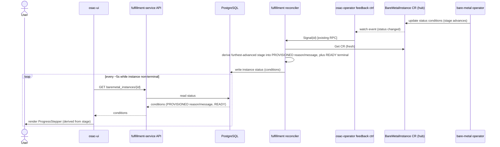

# BMaaS Provisioning Progress and Step Visibility

## Summary

This design surfaces bare metal provisioning progress by populating the existing
`BareMetalInstance` conditions — it adds **no new status fields**. The
fulfillment reconciler derives the furthest-advanced provisioning stage from the
operator's existing lifecycle conditions and stamps it onto the single
`PROVISIONED` condition as a fixed-vocabulary `reason` plus a curated,
non-internal-leaking `message`; `READY` remains the terminal condition. This is
the same coarse-condition, staged-`reason`/`message` shape CaaS just adopted for
its `PROGRESSING` condition (OSAC-4441 / PR #646), so BMaaS becomes consistent
with the rest of OSAC rather than introducing a BMaaS-specific construct. The UI
renders a read-only `ProgressStepper` computed from the current stage. The DB copy
stays fresh within seconds via the existing osac-operator feedback→`Signal` path
(no new watch, no new proto or CRD field).

Scope note (this iteration): **provisioning progress only**. Deprovisioning
progress, a durable ordered per-phase timeline with per-phase durations, and
`CONFIGURATION_APPLIED`-driven day-2 progress are explicitly deferred (see
Non-Goals and Deferred / Follow-up work). See [PRD](prd.md) for requirements.

## Motivation

Today a bare metal instance shows only a coarse lifecycle badge (`PROVISIONING`,
`READY`, `FAILED`) plus a raw conditions table in the UI. The fulfillment
reconciler that derives the instance's API status reads only two of the operator
conditions and sets the `PROVISIONED` condition as a binary ratchet with an
**empty reason and message** [Codebase:
fulfillment-service/internal/controllers/baremetalinstance/baremetalinstance_reconciler_function.go]
— so the largely sequential provisioning signal the operator already tracks (host
allocation, the provisioning job, network handoff, and readiness) is discarded
before it reaches the API. When a deployment stalls or fails, the user cannot tell
which step is running or where it stopped.

Two implementation-level facts shape this design. First, bare-metal provisioning
is driven by a single opaque AAP job (`osac-create-bare-metal-instance`), not by
separable metal3/Ironic states — the metal3 `BareMetalHost` is inventory and
power management only and exposes no observable per-step provisioning signal
[Research: loop-back Domain 7]. Hardware preparation, OS deployment, and
configuration therefore all happen inside that one job and cannot be
independently observed; they collapse into a single **Provisioning** stage. Only
Host Allocation, Network Setup, and Ready are independently observable via
osac-operator conditions. Second, the DB↔hub freshness path already exists: the
osac-operator feedback controller already watches the hub CRs and rings
fulfillment via a `Signal(id)` RPC on status change, and the fulfillment
reconciler already re-reads the CR and updates the DB within seconds — so no new
watch is needed, only richer `reason`/`message` content on the conditions the
reconciler already writes [Research: loop-back Domain 8].

Crucially, OSAC already has an established, just-merged shape for exactly this
problem. CaaS expresses installation progress as a fixed, order-independent stage
vocabulary folded into the `reason`/`message` of its single `PROGRESSING`
condition, refreshed on every reconcile, with a terminal `READY` condition
(`applyProgressingStageDetail` over `clusterOrderProvisioningStages`) [Codebase:
osac-operator/internal/controller/feedback_controller.go; PR #646 / OSAC-4441].
BMaaS should reuse that shape rather than invent a parallel one.

This design closes the visibility gap for provisioning while keeping the
cross-service progress experience consistent with CaaS (OSAC-1604) and VMaaS
(OSAC-1027).

### Goals

- Reuse the OSAC coarse-condition progress pattern: express the current
  provisioning stage as the `reason` of the existing `PROVISIONED` condition and a
  curated human-readable `message`, refreshed each reconcile, with `READY` as the
  terminal condition — the same shape CaaS uses, so the shared status label and
  conditions table stay consistent across services [PRD: In Scope; Locked pattern
  reuse].
- Add **no new proto or CRD status fields**: populate the `reason`/`message`
  fields that already exist on `BareMetalInstanceCondition`, and fix the current
  empty-reason `PROVISIONED` ratchet mis-wiring so the stage progression
  (Host Allocation → Provisioning → Network Setup → provisioned → Ready) is
  actually surfaced.
- Reuse the existing osac-operator feedback→`Signal` freshness path so the stage
  reflected in the API tracks backend changes within seconds — no new hub-side
  watch is introduced.
- Introduce a single reusable read-only `ProgressStepper` UI computed from the
  current stage, usable later by VMaaS/CaaS without a model change.

### Non-Goals

- No user-initiated actions on the progress view: no retry, re-provision, or any
  mutating control [PRD: Out of Scope].
- No changes to the metal3/Ironic provisioning automation or AAP playbook logic;
  this design only observes and surfaces existing backend signals [PRD: Out of
  Scope].
- No per-phase log or command output [PRD: Out of Scope].
- No cross-tenant aggregated list of in-progress instances [PRD: Out of Scope].
- No progress-model changes for VMaaS or CaaS in this feature.
- **No new phase/timeline status fields.** The single coarse condition retains
  only the *current* stage and its `lastTransitionTime`, not an ordered per-phase
  history with per-phase durations. A durable, viewable-after-completion timeline
  is deferred (see Deferred / Follow-up work).
- **No deprovisioning progress** in this iteration (deferred — see below).
- **No `CONFIGURATION_APPLIED`-driven provisioning progress.**
  `CONFIGURATION_APPLIED` is reserved for future day-2 configuration operations
  and is not part of this design's progress surface.

### Deferred / Follow-up work

These were part of the original design intent and PRD but are intentionally
deferred so this iteration ships the consistent, low-risk core:

- **Durable ordered per-phase timeline (DoD #3).** A persisted, ordered history
  of every phase with per-phase transition timestamps and derived durations — and
  any provisioning event-timeline/log view — is a separate, cross-cutting
  follow-up. Model B's single coarse condition intentionally keeps only the
  current stage; the terminal/failure state persists (see Persistence), but the
  full ordered history does not. Tracked as a follow-up; the per-stage
  `lastTransitionTime` already present on the condition makes such a timeline
  derivable later without changing this design.
- **Deprovisioning progress.** Teardown stage visibility (Teardown Initiated →
  Cleaning → Released), including any release/finalizer coordination, is deferred.
  Deletion continues to surface only the coarse `DELETING` state as it does today.
- **Day-2 configuration progress via `CONFIGURATION_APPLIED`.** Surfacing progress
  of post-provision configuration changes is future work reserved to that
  condition.

## Proposal

The change spans two components in dependency order; there is **no proto or CRD
schema change**.

1. **fulfillment-service reconciler.** Extend `syncStatus()` to derive the
   furthest-advanced provisioning stage from the operator's existing lifecycle
   conditions and set the `PROVISIONED` condition's `reason` to a fixed stage
   value and its `message` to a curated, non-internal-leaking string; flip
   `PROVISIONED` to `True` when provisioning completes; set `READY` to the
   terminal reason/message when the instance is available; and on failure set the
   relevant condition `False` with a fixed failure `reason` and its curated
   `message`. This replaces today's empty-reason ratchet.

2. **osac-ui.** Add a read-only `BareMetalProgressStepper` to the instance detail
   view that computes the four user-facing steps (Host Allocation → Provisioning
   → Network Setup → Ready) from the current `PROVISIONED` `reason` and the
   `READY` condition: earlier steps `success`, the current stage `running`, later
   steps `pending`, and — on failure — the failing step `danger` with the curated
   `message`. It auto-refreshes while the instance is non-terminal and stops once
   terminal.

The existing coarse `state` and `conditions` remain the single source of status;
this design only enriches the `reason`/`message` the reconciler already had the
mechanism to write (`updateCondition(type, status, reason, message)` +
`sanitizeConditionMessage`). Because the fulfillment DB already stores the
instance's proto status as JSON, the terminal/failure `reason`/`message` persist
across CR deletion with no new storage.

**Stage vocabulary (the `PROVISIONED` `reason` while provisioning).** A fixed,
ordered, order-independent vocabulary — mirroring CaaS's
`clusterOrderProvisioningStages` (furthest-advanced stage wins, so the result
never depends on condition ordering):

| Stage `reason` | Meaning | Backend signal (furthest-advanced True) |
|---|---|---|
| `HostAllocation` | Selecting and allocating a bare metal host | before `Allocated` True |
| `Provisioning` | Installing the OS and applying configuration (single opaque AAP job) | `Allocated` True, before `ProvisionTemplateComplete` True |
| `NetworkSetup` | Attaching networks and discovering addresses | `ProvisionTemplateComplete` True, before network conditions True |

Once the network/provisioning conditions are all True, `PROVISIONED` flips
`True` with reason `Provisioned` (message: "Infrastructure has been allocated and
provisioned."). When the instance reaches its powered-on ready state, `READY`
flips `True` with reason `Ready` (message: "The instance is ready."). The
**current stage** is therefore always derivable as `PROVISIONED.reason` (while
`PROVISIONED` is not yet `True`), exactly as CaaS derives it from
`PROGRESSING.reason`.

**Why reuse `PROVISIONED` rather than add a `PROGRESSING` condition.** BMaaS has
no `PROGRESSING` condition, but it does not need one: `PROVISIONED` is the natural
progress-bearing condition for the provisioning sequence (its proto meaning,
"infrastructure has been allocated/provisioned", is precisely what the sequence
converges to). Using its `reason` to carry the in-flight stage and flipping it
`True` at completion keeps the API surface unchanged and matches the CaaS
one-progress-condition shape. `CONFIGURATION_APPLIED` is deliberately left out of
the progress narrative and reserved for day-2 operations.

### Workflow Description

Actors: **Tenant User**, **Tenant Admin**, and **Cloud Provider Admin** — all
have the same read-only view of an instance they can already see.

Starting state: a bare metal instance has been ordered and its `BareMetalInstance`
CR exists on the hub.

1. The user opens the instance detail page. The page issues a
   `GET /api/fulfillment/v1/baremetal_instances/{id}` and renders a vertical
   stepper of the four known steps — Host Allocation → Provisioning → Network
   Setup → Ready — computing each step's state from `status.conditions`: the
   `PROVISIONED` `reason` names the current running stage (earlier steps
   `success`, current `running`, later `pending`), and `READY` `True` marks the
   terminal step done.
2. Each step shows its state (pending, running with a spinner, succeeded, or
   failed); the current step shows the curated `message` from the driving
   condition. Per-step *durations* are **not** shown in this iteration (the single
   condition retains only the current stage's `lastTransitionTime`) — a durable
   per-phase timeline is deferred.
3. While the instance is non-terminal, the detail query re-fetches on a bounded
   ~5s polling interval (a per-page interval, not the global ~10s default); the
   operator updates the CR conditions, the osac-operator feedback controller
   signals fulfillment, which re-syncs the DB within seconds, and the next poll
   shows the advanced stage without any user action.
4. On failure, the failing step renders in the danger variant with a
   phase-specific, human-readable `message` (for example, "OS installation and
   configuration did not complete; the provisioning job failed."); no raw internal
   error is shown, and no retry control is offered.
5. When provisioning completes, `PROVISIONED` is `True` and `READY` is `True`; all
   four steps show succeeded and refetching stops.
6. After the instance is released and its CR removed, the detail view continues to
   serve the last persisted conditions (terminal or failure `reason`/`message`)
   from the fulfillment DB until the instance record is archived on finalizer
   removal, after which the public `GET` returns 404 as for any released instance.

This diagram shows the freshness path the design reuses — the existing
osac-operator feedback controller → `Signal(id)` → reconciler re-read → DB write —
and the UI polling path. Total UI-visible freshness has two bounded parts:
source-side (CR→DB) is bounded by the existing feedback path (seconds), and DB→UI
is bounded by the UI's ~5s per-page poll while the instance is non-terminal.
Polling stops once the instance is terminal.

### API Extensions

This enhancement changes **no** API schema: it adds no gRPC services, webhooks,
aggregated API servers, proto messages, enums, or fields, and no CRD fields. It
populates the existing `reason` and `message` fields of the existing
`BareMetalInstanceCondition` and does not read or modify resources owned by other
teams (in particular, it does not depend on metal3 CRD internals).

The concrete interface changes (referenced by the testplan as IC-N):

- **IC-1 — Staged `reason`/`message` on the existing `PROVISIONED` condition (no
  schema change).** The fulfillment reconciler populates the existing `reason`
  (fixed stage vocabulary) and `message` (curated prose) of the `PROVISIONED`
  `BareMetalInstanceCondition`, and the terminal `reason`/`message` on `READY`.
  No proto/CRD change. Requirements: FR-1, FR-2, NFR-3.
- **IC-2 — Reconciler stage derivation + curated messages (`syncStatus`).** Extend
  the fulfillment reconciler's `syncStatus()` to derive the furthest-advanced
  provisioning stage from the operator's existing lifecycle conditions
  (`Allocated`, `ProvisionTemplateComplete`, network/power conditions) — using a
  fixed, order-independent stage list as CaaS does — and stamp
  `PROVISIONED.reason`/`message`; flip `PROVISIONED` `True` at provisioning
  completion and `READY` `True` at readiness; extend `sanitizeConditionMessage` to
  cover the in-progress stage vocabulary (today it returns text only for
  `status == True`). Fixes the current empty-reason ratchet. Requirements: FR-1,
  FR-2, FR-5.
- **IC-3 — Freshness via the existing feedback→`Signal` path.** The osac-operator
  feedback `Signal(id)` already fires on `BareMetalInstance` status (condition)
  changes; confirm it fires on `PROVISIONED`/`READY` `reason`/`message`
  transitions so the reconciler re-syncs the DB within seconds. No new watch or
  informer. Requirements: NFR-1.
- **IC-4 — UI progress stepper.** Add the read-only `BareMetalProgressStepper` to
  the instance detail view, deriving the four steps from the `PROVISIONED`
  `reason` and `READY` condition, rendering the curated `message`, auto-refreshing,
  with an `aria-live` region. Requirements: FR-1, FR-3, FR-5, NFR-2.
- **IC-5 — Failure message mapping.** Define the exact human-readable failure
  `message` the reconciler writes into the failing condition. The mapping is
  **fixed and deterministic**: each failure reason maps to exactly one message
  string, so a consumer or test can assert one expected `message` per reason.
  (Deprovisioning failures are out of scope this iteration.)

  | Stage | Failure reason (from failing condition/job) | Exact `message` |
  |-------|---------------------------------------------|-----------------|
  | Host Allocation | `NoMatchingHosts` (no available host matched the profile) | "No bare metal host matched the requested profile." |
  | Host Allocation | `HostAllocationFailed` (host search/claim error other than no-match) | "Host allocation failed." |
  | Provisioning | `ProvisionJobFailed` (the `osac-create-bare-metal-instance` job failed) | "OS installation and configuration did not complete; the provisioning job failed." |
  | Network Setup | `NetworkAttachmentFailed` | "Network attachment did not complete." |
  | Network Setup | `NetworkHandoffFailed` | "Network handoff (reboot) did not complete." |
  | Network Setup | `IPDiscoveryFailed` | "IP address discovery did not complete." |
  | Ready | `ReadyTimeout` (host did not reach powered-on ready state) | "The instance did not reach its powered-on ready state." |

  These strings are the complete vocabulary; the reconciler never copies a raw
  operator/AAP/metal3 error string into `message`, and no other message value is
  emitted. Requirements: FR-5.

Operational impact: if the operator is down, the stage stops advancing but the
last-synced conditions remain served from the DB. If the fulfillment reconciler
is down, the DB is not refreshed; the API serves the last-known conditions and
resumes on restart (the reconciler re-syncs via its existing full-resync path). If
the feedback→`Signal` path is disrupted, the design degrades to the existing
periodic full resync (correctness preserved, freshness reduced).

## UX Alignment

The `@temp-api` file `osac-ux/libs/ui-components/src/api/v1/baremetal-instance.ts`
imports the instance type from generated protobuf types and already exposes
`status.state` and `status.conditions` (each condition carrying `type`, `status`,
`lastTransitionTime`, `reason`, `message`). **This EP adds no new fields to that
type** — the UI reads the `reason`/`message` that already exist on
`status.conditions[]`. No `pnpm gen-types` migration is required for new fields;
the only UI work is the new component that computes the stepper from existing
condition data.

| UI field (`@temp-api` TypeScript) | Proto field | Notes / deviation |
|---|---|---|
| `status.conditions[].type` | `status.conditions[].type` | Unchanged; UI matches `PROVISIONED` / `READY` |
| `status.conditions[].reason` | `status.conditions[].reason` | Unchanged field; now carries the fixed stage vocabulary while provisioning |
| `status.conditions[].message` | `status.conditions[].message` | Unchanged field; now carries curated stage/failure prose |
| `status.conditions[].lastTransitionTime` | `status.conditions[].last_transition_time` | Unchanged; marks the current stage's transition (no per-phase history) |
| `status.state` | `status.state` | Unchanged; still drives the coarse status label |

No known anti-patterns apply: the change is read-only observed state carried on
existing condition fields — no sub-resource action, string-union storage class,
K8s-internal field, one-time secret, or RHOAI operator field.

### Implementation Details/Notes/Constraints

#### No schema change

There is intentionally **no** proto or CRD change. The design uses the existing
`BareMetalInstanceCondition{ type, status, last_transition_time, reason, message }`
[Codebase:
fulfillment-service/proto/private/osac/private/v1/baremetal_instance_type.proto]
and the existing operator lifecycle conditions [Codebase:
bare-metal-fulfillment-operator/api/v1alpha1/baremetalinstance_types.go]. This is
the central simplification over the earlier two-array design and the reason the
change is additive and low-risk.

#### Reconciler stage derivation

The fulfillment reconciler's `syncStatus()` is the single place that derives the
stage. It mirrors the CaaS `applyProgressingStageDetail` pattern [Codebase:
osac-operator/internal/controller/feedback_controller.go]:

- A fixed, ordered stage list keyed off the operator's existing lifecycle
  conditions; the **furthest-advanced** True condition selects the stage, so the
  result is order-independent (does not depend on the order conditions appear in
  the CR).
- While `PROVISIONED` is not yet `True`, its `reason` is set to the current stage
  value and its `message` to the curated string for that stage.
- When all provisioning/network conditions are True, `PROVISIONED` is set `True`
  with the terminal `Provisioned` reason/message.
- When the instance is available (powered-on ready), `READY` is set `True` with
  the `Ready` reason/message.
- On a failing condition/job, the relevant condition is set `False` with the fixed
  failure `reason` and its IC-5 `message`.

`sanitizeConditionMessage` is extended to return curated text for the in-progress
stages (today it returns a message only for `status == True`), so a provisioning
instance carries a non-empty `message`. The reconciler owns the message
vocabulary (single, testable source), exactly as CaaS humanizes stage reasons in
one function.

Current mis-wiring being fixed: `PROVISIONED` is set `True` with an empty
`reason`/`message` when `HostConditionProvisionTemplateComplete == True`, and
`READY` is set with empty `reason`/`message` [Codebase:
baremetalinstance_reconciler_function.go]. After this change, `PROVISIONED`
carries the stage progression and flips `True` at true provisioning completion,
and `READY` carries its terminal message.

#### Phase-to-backend-signal mapping

The reconciler derives each user-facing step from an authoritative operator
condition; metal3 exposes no per-step provisioning signal beyond the coarse BMH
state, and the AAP `JobStatus.Timestamp` is trigger-only, so the operator's
lifecycle conditions are the authoritative source.

| Step | Condition/Signal (furthest-advanced True) | Surfaced as |
|---|---|---|
| Host Allocation | `Allocated` (operator host search) | `PROVISIONED` reason `HostAllocation` (before `Allocated`) → step done at `Allocated` |
| Provisioning | single `osac-create-bare-metal-instance` AAP job → `ProvisionTemplateComplete` | `PROVISIONED` reason `Provisioning` |
| Network Setup | `NetworkAttachmentsReady` → `NetworkHandoffComplete` → `IPDiscoveryComplete` | `PROVISIONED` reason `NetworkSetup`; on completion `PROVISIONED` `True` |
| Ready | `PowerSynced` → instance available (absorbs readiness/verification) | `READY` `True`, reason `Ready` |

Behavior for the cases the PRD asks the design to define [PRD: Assumptions]:

- **Milestone vs. running:** each of the four steps is derived from the current
  stage; Host Allocation is short but is shown running while host search is
  underway. There are no separate point-in-time milestones in this iteration
  (those belonged to the deferred deprovisioning timeline).
- **No work to do (e.g. no network attachment):** the reconciler treats a stage
  with no work as already satisfied — the derivation advances past it (the
  furthest-advanced True condition already reflects completion), so the instance
  never lingers on `NetworkSetup` when there is nothing to attach. The UI renders
  that step `success` rather than leaving it stuck. (A distinct `SKIPPED` visual
  is not modelled, since there is no per-phase state field.)
- **Retried:** retries within a stage (the AAP job) do not change the derived
  stage; `PROVISIONED` stays on that stage's `reason` until the driving condition
  reaches its terminal state. Sub-retry detail is not surfaced (no log access, per
  Non-Goals).
- **Overlapping / collapsed:** OS install and configuration both run inside the
  single provision job and are attributed to the single **Provisioning** stage;
  the user always sees a strictly ordered sequence.

#### Reconciler and freshness

Freshness reuses the existing feedback path rather than adding a new watch. The
osac-operator already runs a feedback controller that watches the hub
`BareMetalInstance` CRs and rings fulfillment via a `Signal(id)` RPC when their
status changes; that signal triggers the fulfillment reconciler to re-read the CR
and update the DB within seconds [Research: loop-back Domain 8]. Because the stage
is carried on condition `reason`/`message`, an advancing stage **is** a status
change, so it already flows through this path — this design adds no new informer,
watch, or polling loop, and only confirms the `Signal` fires on
`reason`/`message` transitions. The existing periodic full resync is retained as a
correctness backstop.

#### Persistence and retention

The fulfillment DB stores the instance's proto status as JSON, so the last-written
conditions — including the terminal `READY`/`PROVISIONED` reason/message or a
failure `reason`/`message` — survive CR deletion and are served read-only for
completed and failed instances, and for released instances **for the life of the
fulfillment instance record**. This satisfies "which stage the instance reached
or failed at, and why, remains viewable after completion" (FR-4, re-scoped). The
**full ordered per-phase history with durations is not retained** — that durable
timeline is deferred (see Deferred / Follow-up work). On release the operator
removes the CR's finalizer; fulfillment then soft-deletes and archives the record
to `archived_<table>`, after which the public `GET` returns 404 (there is no
archive-read path) [Research: loop-back Domain 9].

#### UI

`BareMetalProgressStepper` (osac-ui) renders a vertical PatternFly
`ProgressStepper` of the four fixed steps, computing each step's variant from the
current stage:

- Steps before the current stage → `success`.
- The current stage (from `PROVISIONED.reason`, while `PROVISIONED` is not `True`)
  → `info` with a spinner and `isCurrent`.
- Steps after the current stage → `pending`.
- On a failing condition → the failing step `danger` with the curated `message`.
- `PROVISIONED` `True` + `READY` `True` → all steps `success`.

Each step's `description` shows the curated `message` for the current/failed step;
**no per-step duration is shown** (deferred). The component is read-only (no
actions) and pairs the stepper with a visually hidden `aria-live="polite"` region
restating the current step so poll-driven updates are announced. It uses the
`useBareMetalInstance` query with a **dedicated ~5s `refetchInterval` while the
instance is non-terminal** (a per-page override of the global ~10s default), and
**stops refetching once the instance is terminal** — `READY` `True`, or a
provisioning condition `False` with a failure reason [Codebase:
osac-ui/apps/app-frontend/src/main.tsx]. The same component renders the persisted
terminal/failure state for finished instances.

### Security Considerations

This feature inherits the existing security model without changes. The
`reason`/`message` content is observed state exposed through the same read path
and authorization as the rest of `BareMetalInstanceStatus`; a caller who can `GET`
the instance can see its conditions, and no new mutating surface is added (the
view is read-only per Non-Goals). No user input reaches the `reason`/`message`.
The human-readable failure messages are drawn from a fixed reconciler-defined
vocabulary and deliberately exclude raw internal errors [PRD: In Scope], avoiding
leaking implementation detail across the tenant boundary.

### Failure Handling and Recovery

- **A provisioning stage fails.** The reconciler sets the relevant condition
  `False` with a fixed failure `reason` and curated `message` and stops advancing;
  the UI renders the danger variant on that step. Later steps remain `pending`.
  Recovery is out of scope (read-only) — the user deletes and re-orders.
- **Operator down mid-stage.** The CR stops advancing; the DB serves the last
  conditions. On restart the operator resumes reconciliation and the derived stage
  continues.
- **Fulfillment reconciler restarts mid-reconcile.** The condition write is
  idempotent; on restart the reconciler re-syncs via its existing full-resync
  path, converging the DB to the current CR.
- **Feedback→`Signal` path disrupted.** Freshness degrades to the existing
  periodic full resync; conditions are still eventually consistent and no data is
  lost.
- **A stage has no work to do.** The derivation advances past it (see the mapping
  notes), so the instance never gets stuck on an inapplicable stage.

### RBAC / Tenancy

No tenancy or RBAC changes are required. The change only populates existing
condition fields on an existing tenant-scoped resource, served through the same
authorization path; visibility follows the instance's existing tenant scoping. No
new resources are introduced, and the reconciler writes only to the DB as it does
today (there is no write-back to the CR in this iteration — that was part of the
deferred deprovisioning handshake), so no new `patch` permission on the hub is
needed. Existing `osac.openshift.io/tenant` / `osac.openshift.io/owner-reference`
metadata on `BareMetalInstance` is unaffected [Codebase:
bare-metal-fulfillment-operator/api/v1alpha1/baremetalinstance_types.go].

### Observability and Monitoring

No new Prometheus metrics or alerts are introduced. The operator continues to
emit Kubernetes events on condition transitions via existing condition-change
event recording; the stage is observable through the API conditions and CR status.
A per-stage "stalled" metric is a natural follow-up but is out of scope — the
`PROVISIONED.lastTransitionTime` already makes the time-in-current-stage derivable
later without a schema change.

### Risks and Mitigations

- **Changing `PROVISIONED` semantics.** Moving `PROVISIONED` from a
  `ProvisionTemplateComplete`-driven ratchet to a stage-carrying condition that
  flips `True` at full provisioning completion could affect any consumer that read
  its old timing. Mitigation: `PROVISIONED` still flips `True` on the happy path
  and only its `reason`/`message` and exact True-instant change; the coarse
  `state` enum (the primary consumer signal) is unchanged. Audit current
  `PROVISIONED` readers during implementation.
- **Reason/message vs. coarse state divergence.** Mitigation: the reconciler
  derives the stage in one place from the operator conditions, so the stage and
  the coarse `state` cannot drift.
- **Stage-mapping drift as the operator lifecycle evolves.** Mitigation: the
  mapping lives in one reconciler function with unit tests over condition/job
  fixtures, mirroring CaaS's tested `applyProgressingStageDetail`.
- **Refresh cost.** Bounded to a single-instance GET on an open detail page while
  non-terminal (~5s poll), stopping at terminal.

### Drawbacks

Reusing a single coarse condition means the API retains only the *current* stage,
not an ordered history — so this iteration cannot show a per-phase timeline with
durations. This is an accepted trade-off: it ships the consistent, low-risk core
now (matching CaaS), and the durable timeline is a deferred follow-up for which
the per-stage `lastTransitionTime` is already a foundation. In exchange the design
adds no new proto/CRD fields, no new persistence, and no new freshness path.

## Alternatives (Not Implemented)

- **Two ordered phase-array status fields (`provisioning_phases` /
  `deprovisioning_phases`) — the earlier draft of this design.** Model each phase
  as an entry in a new `repeated BareMetalInstancePhaseProgress` field, with new
  enums, a CRD struct, and a reconciler-gated finalizer handshake for the terminal
  Released instant. Pros: full ordered history with per-phase durations, retained
  across teardown. Cons: substantial net-new API surface (two fields, two enums, a
  message, a CRD struct) with **no VMaaS/CaaS precedent** — and it re-introduces
  exactly the multi-stage-status shape that CaaS's OSAC-4441 (PR #646) paid down
  in favour of a single order-independent progress condition. Rejected in favour
  of consistency; the durable ordered timeline is deferred as a follow-up rather
  than built as a BMaaS-specific construct.
- **One `metav1.Condition` per phase.** Model each phase as its own condition
  type. Cons: conditions are a semantically unordered set, so multiple
  lifecycle-coupled condition types bloat the shared conditions table, provide no
  ordering, and break coarse-status consistency. Rejected — the single
  `PROVISIONED` reason/message covers current-step consistency.
- **Dedicated progress CRD or DB history table.** A separate resource/table for
  the timeline. Cons: no OSAC precedent, new CRD/proto/RPC + DB migration + second
  fetch path, disproportionate. Rejected; the deferred durable-timeline follow-up
  can revisit persistence if a full history is later required.
- **Shortened global reconciler `SyncInterval`, or a new hub-side watch, for
  freshness.** Cons: unnecessary — the osac-operator feedback controller already
  Signals fulfillment on CR status change and delivers seconds-level freshness
  today [Research: loop-back Domain 8]. Rejected: this design reuses the existing
  `Signal` path.

## Open Questions

- **Should `PROVISIONED` continue to be set `True` at `ProvisionTemplateComplete`,
  or only at full provisioning completion (post-network)?** This design proposes
  the latter (fixing the mis-wiring), but if a current consumer depends on the
  earlier True-instant, the stage vocabulary can instead flip `PROVISIONED` `True`
  at `Allocated` and carry later stages differently. **Impact:** affects the exact
  True-instant of one condition; the coarse `state` is unaffected. To be confirmed
  against current `PROVISIONED` readers during implementation.

## Test Plan

**Note:** *Section not required until targeted at a release.* Concrete scenarios,
mapped to the requirement/interface-change matrix, are enumerated in
`testplan.md`.

### Unit Tests

- Stage-derivation function: each operator lifecycle-condition / AAP job-status
  fixture maps to the correct `PROVISIONED.reason` and `message`, selecting the
  furthest-advanced stage order-independently; `PROVISIONED` flips `True` at
  completion and `READY` `True` at readiness.
- `sanitizeConditionMessage`: returns the curated in-progress message for each
  stage and never emits raw error text.
- Failure vocabulary: each failure reason produces its defined human-readable
  message and no raw error text.

### Integration Tests

- envtest: driving a `BareMetalInstance` CR through Host Allocation →
  Provisioning → Network Setup → Ready produces the expected `PROVISIONED`
  reason/message progression and a terminal `READY` `True`.
- Feedback→`Signal` path: a CR condition change (reason/message) triggers a DB
  sync within seconds (fulfillment reconciler against a kind cluster).
- Persistence: after CR deletion, the API still serves the last terminal/failure
  conditions up to record archival.

### E2E Tests

- pytest (`tests/e2e/`): order a bare metal instance and assert the API exposes
  the advancing `PROVISIONED` reason and terminal `READY`.
- osac-ui (Vitest + RTL / Cypress): the detail view renders the stepper with
  correct variants for pending/running/succeeded/failed, shows a failure message
  on a failed step, exposes no retry control, and updates on refetch.

## Graduation Criteria

Graduation criteria will be finalized when targeting a release; the measurable
gates per stage are:

- **Dev Preview:** `PROVISIONED` reason/message advances end-to-end for the happy
  path; stage-derivation unit tests cover every operator condition / AAP
  job-status fixture; the UI stepper renders the four steps against a kind
  cluster.
- **Tech Preview:** all testplan cases pass (FR-1…FR-5, NFR-1…NFR-3), including
  the failure (FR-5/IC-5) and freshness (TC-NFR1-01) scenarios; NFR-1 freshness is
  verified to meet single-digit seconds via the feedback→`Signal` path in e2e; no
  regression in the coarse `state`/`conditions` layer.
- **GA:** the feature has run in a production-representative deployment across at
  least one full provisioning cycle without the derived stage diverging from the
  CR, and the failure-message vocabulary has been reviewed with support.

**Documentation.** User-facing change is limited to the instance detail view; the
new stepper needs a short help/legend entry (step meanings, state colors). There
is **no** API-surface documentation change (no new fields/endpoints) — the
`reason`/`message` fields are already documented on the condition. No runbook
change beyond the Support notes below.

## Upgrade / Downgrade Strategy

This changes only the content of existing status fields; there is no schema
migration. On upgrade, existing instances get enriched `reason`/`message` on their
next reconcile; older readers that ignore `reason`/`message` see unchanged
behavior via the coarse `state`. Downgrade is safe: an older reconciler simply
writes the previous empty-reason conditions again on its next reconcile — the
content is derived state, re-derivable from the CR.

## Version Skew Strategy

The stage is derived entirely by the fulfillment reconciler from the operator's
existing conditions, so operator/reconciler skew is tolerated: an older reconciler
writes empty-reason conditions (existing behavior); a newer reconciler reading an
older operator's CR derives the stage from whatever lifecycle conditions are
present. No new fields and no CRD version migration are involved.

## Support Procedures

- **Detection:** a stalled stage (`PROVISIONED.reason` unchanged past expected
  duration) indicates a backend stall; for the Provisioning stage, correlate with
  operator logs and the `osac-create-bare-metal-instance` AAP job status. A stage
  that never updates in the UI while the CR advances indicates a feedback-path or
  reconciler problem — check the fulfillment reconciler logs and `Signal`/DB-sync
  events.
- **Disabling:** the feature has no feature gate; to suppress the UI, the stepper
  component can be hidden without backend changes. The enriched `reason`/`message`
  are inert if unread. Disabling has no effect on provisioning itself (observation
  only).
- **Recovery:** restarting the fulfillment reconciler re-syncs CRs via its
  existing full-resync path and reconverges the DB; consistency is maintained
  because the conditions are a full-replace derived projection of the CR.

## Infrastructure Needed

None. Existing repositories, CI, and test infrastructure (envtest, kind, pytest
e2e) cover the change.

---

## Provenance

Authored: draft @ design 0.9.0 - 562b610, workspace main @ d27d7951b
Final: revise @ design 0.9.0 - 562b610, workspace main @ 770f353d1

> Context changed between draft and revise.

<!-- ai-workflow-provenance:{"schema_version":1,"provenance_kind":"session","workflow":"design","workflow_version":"0.9.0","ai_workflows":"562b610","source_repo":"770f353d1","source_repo_branch":"main","commits_behind_main":0,"commits_ahead_main":0,"main_ref":"main","phases":["draft","revise","research","revise","revise","revise","revise","revise","revise","respond","respond","respond","revise"],"authoring_modes":["skill"],"context_changed":true,"origin_untracked":false} -->
