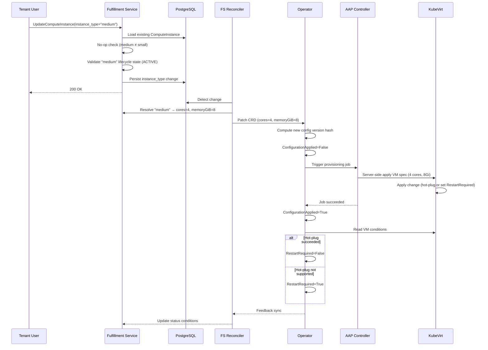

# VM Resize via InstanceType Selection

## Summary

This design enables Tenant Users and Tenant Admins to change a running
ComputeInstance's InstanceType through the existing Update RPC, allowing
CPU, memory, and GPU scaling without VM recreation. The change propagates
through the existing fulfillment-service → osac-operator → AAP → KubeVirt
pipeline by lifting three layers of immutability (API validation, CRD CEL
rules, and CRD field constraints) and reusing the operator's config-version
hash mechanism for change detection and re-provisioning. GPU changes follow
the same pipeline but always require a VM restart — KubeVirt does not
support hot-plugging PCI passthrough devices. See [PRD](prd.md) for
detailed requirements.

## Motivation

ComputeInstance CPU and memory are derived from a selected InstanceType —
tenants do not set cores or memory directly. This replaced the direct-value
model originally proposed in OSAC-39. Today, `instance_type` is immutable
after creation: the fulfillment-service rejects changes in Update, the
osac-operator CRD enforces `self == oldSelf` on `cores` and `memoryGiB`,
and the AAP playbook builds KubeVirt VM specs from these values.

When workload demands change, tenants must delete and recreate the
ComputeInstance with a different InstanceType. This loses IP addresses,
attached volumes, running state, and configuration — unnecessary disruption
for a change that KubeVirt can apply to a running VM.

The existing pipeline already supports spec-change-driven re-provisioning:
the operator hashes the CRD spec, detects hash changes, and triggers AAP
re-provisioning. The AAP playbook uses Ansible `apply: true` (server-side
apply), which patches existing KubeVirt VMs rather than only creating new
ones. KubeVirt surfaces a `RestartRequired` condition when hot-plug is not
supported for a given change, and the operator already mirrors this
condition back to the fulfillment-service. The infrastructure for resize
exists — it is blocked only by immutability constraints.

### Goals

- Reuse the existing ComputeInstance Update RPC — no new API endpoints or
  RPCs.
- Leverage the operator's config-version hash mechanism for change detection
  and re-provisioning trigger.
- Reuse the existing `RestartRequired` condition plumbing for hot-plug
  feedback.
- Apply the same InstanceType lifecycle-state validation (ACTIVE /
  DEPRECATED / OBSOLETE) to resize as to creation.
- Keep the InstanceType → cores/memoryGiB/gpu resolution boundary in the
  fulfillment-service reconciler — the operator receives concrete values.
- Surface that GPU changes always require a restart — KubeVirt does not
  support GPU hot-plug.

### Non-Goals

- Disk resize — storage is unaffected by an InstanceType change.
- Quota enforcement on InstanceType changes.
- Automatic VM restart after resize — the user restarts manually when
  `RestartRequired` is set.
- Automatic scaling or auto-resize — InstanceType changes are explicit
  user actions only.
- Live migration during resize — a VM restart is the fallback when
  hot-plug is not supported.
- Audit or tracking of InstanceType changes.

## Proposal

Four immutability constraints are lifted to enable InstanceType changes:

1. **fulfillment-service API validation** — remove `instance_type` from the
   `validateTemplateImmutability()` check and add resize-specific validation
   (no-op detection, lifecycle-state validation).

2. **osac-operator CRD (cores/memory)** — remove the `self == oldSelf` CEL
   XValidation rules from `Cores` and `MemoryGiB` fields.

3. **osac-operator CRD (GPU)** — remove the GPU immutability CEL
   XValidation rule from `ComputeInstanceSpec` that enforces
   `has(self.gpu) == has(oldSelf.gpu) && (!has(self.gpu) || self.gpu == oldSelf.gpu)`.
   This allows adding, removing, or changing GPU configuration when the
   InstanceType changes.

4. **CRD field constraints** — no additional changes needed. The AAP
   playbook already uses `apply: true` and the operator's config-version
   mechanism already triggers re-provisioning on spec changes.

No new CRDs, gRPC services, or Kubernetes controllers are introduced.

### Workflow Description

**Actor:** Tenant User (or Tenant Admin)

**Starting state:** A ComputeInstance exists with `instance_type` referencing
"small" (2 cores, 4 GiB memory).

**Resize flow:**



The diagram shows the end-to-end flow for a resize request. The Tenant User
interacts only with the fulfillment-service API; the reconciler, operator,
AAP, and KubeVirt handle propagation transparently. The critical path is:
API validation → persist → reconciler resolves InstanceType → operator
detects config change → AAP re-provisions → KubeVirt applies or signals
restart.

**Error paths:**

- **OBSOLETE target**: The API rejects the request with `FailedPrecondition`
  before persisting. No downstream effects.
- **DEPRECATED target**: The API persists the change and returns a
  deprecation warning (replacement InstanceType and obsolescence date). The
  resize proceeds normally.
- **Not found**: The API returns `NotFound` if the target InstanceType does
  not exist.
- **No-op (same InstanceType)**: The API returns success immediately. No
  change is persisted, no reconciliation triggered. The no-op check takes
  precedence over lifecycle validation — a request targeting the current
  InstanceType succeeds even when that InstanceType is DEPRECATED or
  OBSOLETE. [PRD: FR-4]

**State constraints:** Resize is allowed whenever Update is allowed. The
API does not restrict resize to RUNNING VMs — a stopped VM can also have
its InstanceType changed (the change applies on next start). The
declarative model applies: the user declares desired state, the system
converges. The operator's provisioning lifecycle handles spec changes
during any reconcilable state.

**Note on downsize:** The PRD explicitly states both increasing and
decreasing InstanceType selections are supported (clarification R1.Q1).
The Jira Feature description lists "downsizing running VMs" as out of
scope — the PRD (finalized through multiple review rounds) takes
precedence. The design supports both directions. OSAC does not manage
guest-level resource pressure — the user is responsible for ensuring the
target InstanceType is appropriate for their workload.

### API Extensions

**Modified gRPC services:**

- `ComputeInstances.Update` (fulfillment-service) — lifts the
  `instance_type` immutability constraint. No new fields, no new RPCs.
  The update mask `spec.instance_type` is accepted and processed.

**Modified CRDs:**

- `ComputeInstance` (osac-operator) — removes `self == oldSelf` CEL
  XValidation from `Cores` (int32) and `MemoryGiB` (int32) fields, and
  removes the GPU immutability CEL XValidation from `ComputeInstanceSpec`.
  All three become mutable, allowing the reconciler to update them when
  the InstanceType changes.

**No new CRDs, webhooks, finalizers, or aggregated API servers.**

Operational impact: if the osac-operator controller is down during a resize,
the CRD update queues and reconciliation resumes when the controller
restarts. The config-version mechanism ensures the correct target state is
applied regardless of controller restarts.

## UX Alignment

No `osac-ux/libs/ui-components/src/api/v1/compute_instance*.ts` file exists.
UX alignment is not applicable for this EP.

### Implementation Details/Notes/Constraints

#### fulfillment-service: Lift Instance Type Immutability

In `private_compute_instances_server.go`, the `validateTemplateImmutability()`
function checks six fields for immutability. Remove `spec.instance_type`
from this check:

```go
// Before: instance_type blocked alongside template, catalog_item, etc.
// After: instance_type removed from the immutability check list.
// Fields that remain immutable: template, template_parameters, catalog_item,
// disk_image, auto_external_ip_attachment.
```

#### fulfillment-service: Add Resize Validation

Add a `validateInstanceTypeResize()` method to the Update path, called
after removing `instance_type` from immutability validation. This method
runs only when the update mask includes `spec.instance_type`:

1. **No-op check**: Compare `refKey(existingSpec.GetInstanceType())` with
   `refKey(newSpec.GetInstanceType())`. If equal, return nil (no-op — skip
   lifecycle validation). [PRD: FR-4]

2. **Lifecycle-state validation**: Call the existing shared
   `validateInstanceTypeState()` helper
   (`catalog_item_validation.go:340-384`). This returns:
   - `nil` for ACTIVE targets
   - A deprecation warning string for DEPRECATED targets
   - `FailedPrecondition` error for OBSOLETE targets
   - `NotFound` error for missing targets

3. **Attach deprecation warning**: If `validateInstanceTypeState()` returns
   a warning, attach it to the Update response using the same mechanism as
   Create.

The Update handler flow becomes:

```go
func (s *PrivateComputeInstancesServer) Update(ctx, request) {
    // ... existing network validation ...
    s.validateTemplateImmutability(ctx, request)  // instance_type removed
    s.validateInstanceTypeResize(ctx, request)     // new: no-op + lifecycle
    s.validateNetworkAttachmentsImmutability(ctx, request)
    s.validateDiskImmutability(ctx, request)
    s.generic.Update(ctx, request, &response)
}
```

#### fulfillment-service: Reconciler — No Changes

The `addExplicitFields()` function in the ComputeInstance reconciler
(`computeinstance_reconciler_function.go:691`) already runs on every
reconcile cycle. It resolves the InstanceType reference by name, reads
`cores`, `memory_gib`, and `gpu` from the InstanceType spec, and sets
them on the CRD spec. When `instance_type` changes in the API, the
reconciler resolves the new values and patches the CRD — this propagation
is automatic with no code changes.

#### osac-operator: CRD Field Mutability

Remove CEL XValidation immutability rules from three locations in
`computeinstance_types.go`:

```go
// Before (Cores and MemoryGiB fields):
// +kubebuilder:validation:XValidation:rule="self == oldSelf",message="cores is immutable"
Cores int32 `json:"cores"`

// +kubebuilder:validation:XValidation:rule="self == oldSelf",message="memoryGiB is immutable"
MemoryGiB int32 `json:"memoryGiB"`

// After: remove the XValidation annotations from both fields.
// Min/Max validation remains (Cores: 1-128, MemoryGiB: 1+).
```

```go
// Before (ComputeInstanceSpec level):
// +kubebuilder:validation:XValidation:rule="has(self.gpu) == has(oldSelf.gpu) && (!has(self.gpu) || self.gpu == oldSelf.gpu)",message="gpu is immutable"

// After: remove the GPU XValidation annotation from ComputeInstanceSpec.
// GpuSpec field validation (PciDeviceSelector, ResourceName, Count 1-16) remains.
```

#### osac-operator: Controller — No Changes

The config-version mechanism already handles spec changes:

1. `handleDesiredConfigVersion()` computes `ComputeDesiredConfigVersion(instance.Spec)`
   using FNV-64a hash of the JSON-marshaled spec.
2. When `Cores` or `MemoryGiB` change, the hash changes.
3. `IsConfigApplied()` returns false, triggering
   `RunProvisioningLifecycle()`.
4. AAP re-provisions with the updated spec.
5. On success, `ConfigurationApplied` is set to True.

The `RestartRequired` condition sync
(`computeinstance_controller.go:804-809`) already mirrors KubeVirt's
`VirtualMachineRestartRequired` condition. When KubeVirt sets this
condition (because hot-plug is not supported for the change), the
operator syncs it to the ComputeInstance CRD, and the feedback controller
propagates it to the fulfillment-service.

#### osac-aap: Playbook — No Changes

The AAP create playbook (`playbook_osac_create_compute_instance.yml`) uses
`kubernetes.core.k8s` with `apply: true`, which performs a Kubernetes
server-side apply. This already handles updates — it patches the existing
KubeVirt VirtualMachine if one exists with the same name. The playbook
extracts `vm_cpu_cores` from `compute_instance.spec.cores` and `vm_memory`
from `compute_instance.spec.memoryGiB` on every invocation, so updated
values propagate automatically.

No separate update playbook is needed. The provisioning lifecycle re-runs
the create playbook for spec changes, which works because of server-side
apply semantics.

#### KubeVirt Hot-Plug Behavior

Whether CPU and memory changes apply live (hot-plug) or require a VM
restart depends on the KubeVirt deployment configuration:

- **With `VMLiveUpdateFeatures` feature gate enabled and appropriate VM
  template settings** (`maxSockets`, memory hot-plug limits): KubeVirt
  applies CPU/memory changes to the running VM without restart.
- **Without hot-plug configuration**: KubeVirt accepts the spec change but
  sets the `VirtualMachineRestartRequired` condition. The VM continues
  running with old resources until the user restarts it.

OSAC does not configure KubeVirt's hot-plug feature gates — this is a
deployment-level decision managed by the infrastructure admin. OSAC's role
is to propagate the spec change and surface the `RestartRequired` condition.
[PRD: FR-5, FR-6]

#### KubeVirt GPU Change Behavior

GPU passthrough (`hostDevices`) is fundamentally different from CPU/memory
changes. GPU devices are bound via VFIO/IOMMU at the host kernel level and
allocated by the kubelet at pod scheduling time. KubeVirt does not support
hot-plugging PCI passthrough devices — `VMLiveUpdateFeatures` covers CPU
sockets and memory only.

A GPU change (adding, removing, or switching GPU type) always requires a
full VM restart: the VM pod must be destroyed and rescheduled so that the
kubelet can allocate the new PCI device. Unlike CPU/memory resize where
`RestartRequired` depends on the deployment's hot-plug configuration, GPU
changes set `RestartRequired` unconditionally.

After restart, the VM may land on a different node if the target GPU device
is not available on the current node. The VM retains its identity (name,
network attachments, volumes).

#### osac-aap: GPU Device Registration — No Changes

The AAP playbook's `configure_permitted_host_devices.yaml` registers GPU
PCI devices in the KubeVirt HyperConverged CR's
`permittedHostDevices.pciHostDevices` on create. When a resize changes the
GPU, the create playbook re-runs (via `apply: true`) and registers the new
device type if not already present.

The previous device entry remains in the HyperConverged CR. This is by
design — the HyperConverged CR is a cluster-wide singleton and its
`permittedHostDevices.pciHostDevices` is an allowlist, not a resource
reservation. Entries declare that a PCI device type *may* be used by VMs
on the cluster; they do not hold devices or consume resources. The delete
flow similarly does not remove entries. No changes are needed here for
resize.

### Security Considerations

This feature inherits the existing security model without changes:

- **Authorization**: Tenant Users and Tenant Admins already have
  `ComputeInstances/Update` permission via OPA policies
  (`authz.rego`). No new permissions are needed — resize uses the
  existing Update RPC.
- **Tenant isolation**: The Update path validates that network references
  belong to the caller's tenant. InstanceType lookup uses the same
  tenant-scoped resolution as Create. No cross-tenant data exposure is
  introduced.
- **Input validation**: The target InstanceType is validated via the
  existing `validateInstanceTypeState()` helper — the same validation
  applied during Create. Invalid or incompatible targets are rejected
  before persisting.

### Failure Handling and Recovery

| Failure Mode | Behavior | User Observation |
|---|---|---|
| **InstanceType not found** | API returns `NotFound` before persist | Immediate error; no state change |
| **OBSOLETE InstanceType** | API returns `FailedPrecondition` before persist | Immediate error; no state change |
| **DB write failure** | API returns internal error; no downstream effects | Retry the request |
| **Reconciler fails to resolve InstanceType** | Reconciler retries on next cycle; CRD not updated | ComputeInstance shows stale spec; `ConfigurationApplied` remains True (no CRD change yet) |
| **CRD patch failure** | Reconciler retries on next cycle | Same as above |
| **AAP job failure** | Operator retries provisioning; `ConfigurationApplied` stays False | ComputeInstance status shows `ConfigurationApplied=False`; VM continues running with previous resources |
| **KubeVirt apply failure** | AAP job reports failure; operator retries | Same as AAP failure |
| **Controller restart mid-resize** | Controller re-reads CRD state on startup; config-version hash is recomputed; pending re-provisioning resumes | Transparent to user; resize may take longer |
| **Concurrent resize requests** | Each Update overwrites `instance_type` in the DB; reconciler resolves the latest value; operator's config-version hash reflects the final spec | The last-write-wins; intermediate InstanceType changes may not be provisioned if superseded before reconciliation |
| **GPU change — target device not on current node** | VM restart succeeds but pod is rescheduled to a node with the target GPU; if no node has the device, the pod stays Pending | ComputeInstance shows `RestartRequired=True`; after restart, VM may be Pending until a node with the target GPU is available |
| **GPU removal (GPU → no-GPU InstanceType)** | Reconciler sets `gpu` to nil on the CRD; AAP re-provisions the VM spec without `hostDevices`; VM restart required | `RestartRequired=True`; VM runs without GPU after restart |
| **GPU addition (no-GPU → GPU InstanceType)** | Reconciler sets `gpu` on the CRD; AAP registers the device in HyperConverged CR and adds `hostDevices` to VM spec; VM restart required | `RestartRequired=True`; VM gains GPU after restart, may move to a different node |

All operations are idempotent. The config-version mechanism ensures
convergence to the desired state regardless of intermediate failures or
restarts.

### RBAC / Tenancy

No RBAC or tenancy changes required. The existing `ComputeInstances/Update`
permission covers resize. Tenant isolation is enforced by the existing
Update path validation — the InstanceType lookup is tenant-scoped, and no
cross-tenant resources are accessed.

### Observability and Monitoring

No new observability changes. Existing monitoring mechanisms apply:

- The `ConfigurationApplied` condition transitions (True → False → True)
  are already observable via the ComputeInstance status.
- AAP job creation and completion are already logged and tracked via
  `provisioningJobs` in the CRD status.
- The `RestartRequired` condition is already surfaced in the ComputeInstance
  status.

### Risks and Mitigations

| Risk | Impact | Mitigation |
|---|---|---|
| **Memory pressure on downsize** | Selecting a smaller InstanceType while the VM uses more memory than the target allows may cause OOM or instability inside the guest | OSAC does not manage guest-level resource pressure. This is the same risk as under-provisioning at creation time. Document that the user is responsible for ensuring the target InstanceType is appropriate for their workload. |
| **AAP job contention** | Rapid successive resize requests could queue multiple AAP jobs | The config-version mechanism coalesces changes — only the final spec state triggers provisioning. An in-flight job that completes with a stale config version triggers a new job with the current spec. |
| **CRD immutability removal is broad** | Removing `self == oldSelf` from `Cores`/`MemoryGiB` and the GPU CEL rule allows any controller or admin with CRD write access to change these fields, not just the fulfillment-service reconciler | The CRD is an internal API surface — tenant access is mediated through the fulfillment-service. RBAC on the CRD restricts write access to the osac-operator service account and cluster admins. |
| **GPU resize always requires restart** | Unlike CPU/memory which may hot-plug, GPU changes always require a full VM restart and may cause the VM to reschedule to a different node | The `RestartRequired` condition surfaces this to the user. The restart behavior is a KubeVirt constraint, not an OSAC limitation. Document that GPU changes require a restart in all deployments. |
| **No GPU-capable node available after resize** | A GPU change may target a device type not present on any node, leaving the VM pod Pending after restart | This is the same risk as GPU provisioning at creation time. The user selects an InstanceType whose GPU is available in their deployment. |

### Drawbacks

Lifting `Cores`/`MemoryGiB` immutability on the CRD removes a safety
net that previously prevented accidental spec drift. Any controller bug
that inadvertently modifies these fields would now be accepted by the
API server rather than rejected by CEL validation. This trade-off is
justified because resize is a core user need, the CRD is an internal
API surface (not tenant-facing), and the config-version mechanism
provides auditability of spec changes.

The design relies on KubeVirt's hot-plug support being configured at
the deployment level rather than managing it within OSAC. This means
the CPU/memory resize experience varies by deployment — some deployments
require a restart, while others support live changes. GPU changes always
require a restart regardless of deployment configuration, because
KubeVirt does not support hot-plugging PCI passthrough devices. After a
GPU resize restart, the VM may be rescheduled to a different node if the
target GPU is not available on the current one. These are KubeVirt
constraints, not OSAC limitations — OSAC surfaces the deployment's
capability rather than prescribing it.

## Interface Changes

### IC-1: UpdateComputeInstance accepts instance_type changes

**Requirements:** FR-1, FR-2

The existing `ComputeInstances.Update` RPC accepts `spec.instance_type`
in the update mask. When the target InstanceType differs from the current
value, the change is persisted and propagated through the reconciliation
pipeline. Both increasing and decreasing InstanceType selections are
supported — the API does not restrict the direction of change. See §API
Extensions for the modified RPC and §Implementation Details for the
validation flow.

### IC-2: Lifecycle-state validation on resize targets

**Requirements:** FR-3

Resize targets follow the same lifecycle-state validation as VM creation:
ACTIVE targets succeed, DEPRECATED targets succeed with a deprecation
warning (including replacement InstanceType and obsolescence date), and
OBSOLETE targets are rejected with `FailedPrecondition`. The validation
uses the existing `validateInstanceTypeState()` shared helper. See
§Implementation Details for the validation sequence.

### IC-3: No-op detection for same InstanceType

**Requirements:** FR-4

A resize request targeting the ComputeInstance's current InstanceType is a
no-op. The API returns success immediately without persisting a change or
triggering reconciliation. The no-op check takes precedence over
lifecycle-state validation — a request targeting the current InstanceType
succeeds even when that InstanceType is DEPRECATED or OBSOLETE.

### IC-4: RestartRequired condition on resize

**Requirements:** FR-5, FR-6

When a resize requires a VM restart (the KubeVirt deployment does not
support hot-plug for the change), the `RestartRequired` condition is set
to True on the ComputeInstance status. This uses the existing condition
plumbing — the osac-operator mirrors KubeVirt's
`VirtualMachineRestartRequired` condition, and the feedback controller
syncs it to the fulfillment-service. The user restarts the VM manually
via the existing `restart_requested_at` mechanism. See §Implementation
Details for the KubeVirt hot-plug behavior.

## Alternatives (Not Implemented)

### Alternative 1: Dedicated Resize RPC

Add a new `ResizeComputeInstance` or `ChangeInstanceType` RPC to the
ComputeInstances service.

- **Pros:** Cleaner separation of concerns; can add resize-specific fields
  (e.g., force flag, scheduling hints) without affecting the general Update
  RPC.
- **Cons:** Duplicates the existing Update pattern; all other mutable field
  changes (`run_strategy`, `restart_requested_at`, `security_groups`) use
  the Update RPC. Adds API surface and OPA policy entries. Inconsistent
  with the declarative "desired state via Update" model.
- **Rejection:** An InstanceType change is a spec update, not a distinct
  operation. The existing Update RPC, validation framework, and
  reconciliation pipeline handle it without modification beyond lifting
  the immutability constraint.

### Alternative 2: InstanceType Field on CRD

Add an `instanceType` field to the osac-operator CRD instead of the
current model where the fulfillment-service reconciler resolves
InstanceType → concrete `cores`/`memoryGiB` values.

- **Pros:** CRD is self-descriptive — the operator knows which InstanceType
  is selected, not just the derived values.
- **Cons:** Requires the operator to access InstanceType data (either via
  the fulfillment-service API or a local copy), breaking the current
  boundary where InstanceType is an API-level concept. Adds coupling between
  the operator and the fulfillment-service's data model.
- **Rejection:** The current boundary is clean and well-established. The
  operator operates on concrete compute values; the fulfillment-service
  owns InstanceType resolution. Resize does not require changing this
  boundary.

### Alternative 3: Do Nothing

Leave `instance_type` immutable and require VM recreation for compute
changes.

- **Pros:** No changes, no risk.
- **Cons:** Tenants lose IP addresses, attached volumes, running state, and
  configuration on every compute change. Unnecessary downtime and disruption.
- **Rejection:** This is the problem the PRD describes.

## Open Questions

### 9.1 Should OSAC configure KubeVirt's hot-plug feature gates?

- **Owner:** To be determined (platform/infrastructure team)
- **Impact:** §Implementation Details (KubeVirt Hot-Plug Behavior). If OSAC
  manages hot-plug configuration, the AAP playbook needs to set
  `maxSockets` and memory limits on the VM template. If not, hot-plug
  availability is a deployment-level concern documented for infrastructure
  admins.

### 9.2 Should resize of stopped VMs be explicitly documented?

- **Owner:** Ygal Blum
- **Impact:** §Workflow Description, documentation. The PRD user stories
  reference "running VM" resize, but the design allows resize in any
  updateable state (including STOPPED). A stopped VM's resize applies on
  next start with no hot-plug concern. This broadens the PRD scope
  slightly — confirm this is intended.

## Test Plan

### Unit Tests

- `validateInstanceTypeResize()` rejects OBSOLETE targets with
  `FailedPrecondition`
- `validateInstanceTypeResize()` returns a deprecation warning for
  DEPRECATED targets
- `validateInstanceTypeResize()` passes for ACTIVE targets
- `validateInstanceTypeResize()` returns nil (no-op) when target equals
  current InstanceType
- No-op check takes precedence over lifecycle validation: same InstanceType
  that is OBSOLETE returns nil
- `validateTemplateImmutability()` no longer blocks `spec.instance_type`
  changes
- `validateTemplateImmutability()` still blocks changes to `template`,
  `template_parameters`, `catalog_item`, `disk_image`,
  `auto_external_ip_attachment`
- Reconciler resolves GPU from new InstanceType and sets it on the CRD spec
- Reconciler clears GPU on the CRD spec when new InstanceType has no GPU

### Integration Tests

- Update a ComputeInstance's `instance_type` via the private gRPC server and
  verify the change is persisted
- Verify the reconciler resolves the new InstanceType and patches the CRD
  with updated `cores` and `memoryGiB`
- Verify the operator detects the config-version change and triggers
  re-provisioning
- Verify `ConfigurationApplied` transitions: True → False (spec change
  detected) → True (provisioning complete)
- Verify `RestartRequired` condition is mirrored when KubeVirt sets it
- CRD accepts updated `cores` and `memoryGiB` values (XValidation removed)
- CRD accepts updated `gpu` values — adding, removing, and changing GPU
  (XValidation removed)
- Verify the operator detects the config-version change when only GPU
  changes and triggers re-provisioning
- Verify `RestartRequired` is set unconditionally after a GPU change

### E2E Tests

- Create a ComputeInstance with InstanceType "A", resize to InstanceType
  "B", verify the VM's CPU and memory reflect InstanceType "B"
- Resize to a DEPRECATED InstanceType — verify success with deprecation
  warning
- Resize to an OBSOLETE InstanceType — verify rejection
- Resize to the current InstanceType — verify no-op (no state change, no
  re-provisioning)
- Resize from a non-GPU InstanceType to a GPU InstanceType — verify GPU
  is added to the VM spec and `RestartRequired` is set
- Resize from a GPU InstanceType to a non-GPU InstanceType — verify GPU
  is removed from the VM spec and `RestartRequired` is set
- Resize from one GPU InstanceType to another with a different GPU —
  verify the VM spec reflects the new GPU device and `RestartRequired`
  is set
- Resize a STOPPED ComputeInstance — verify the change applies on next start
  (if Open Question 9.2 confirms this is in scope)

## Graduation Criteria

Graduation criteria will be defined when targeting a release. Expected
stages: Dev Preview → Tech Preview → GA based on production deployment
feedback.

## Upgrade / Downgrade Strategy

**Upgrade:** The CRD schema change (removing `self == oldSelf` from `Cores`
and `MemoryGiB`, and removing the GPU immutability CEL rule from
`ComputeInstanceSpec`) is applied via `make manifests` and CRD reapply.
Existing ComputeInstances are unaffected — their specs do not change. The
fulfillment-service code change (lifting immutability) deploys with the
normal release cycle.

**Downgrade:** Reverting the CRD restores immutability on `Cores`,
`MemoryGiB`, and GPU. Any ComputeInstance whose spec was modified during
the upgrade window retains its current values — the CRD validation only
prevents future changes, not existing state. Reverting the
fulfillment-service restores the `instance_type` immutability check.
ComputeInstances resized during the upgrade window keep their new
InstanceType.

## Version Skew Strategy

The fulfillment-service and osac-operator can be deployed independently.
During version skew:

- **New fulfillment-service, old operator:** The API accepts
  `instance_type` changes and the reconciler resolves new
  `cores`/`memoryGiB`/`gpu` values, but the old CRD rejects the update
  (`self == oldSelf` on cores/memory, GPU immutability CEL rule). The
  reconciler logs the rejection and retries. No data loss — the API-level
  change is persisted, and reconciliation succeeds once the operator is
  updated.

- **Old fulfillment-service, new operator:** The API rejects
  `instance_type` changes (`InvalidArgument`). The new CRD accepts
  `cores`/`memoryGiB`/`gpu` changes but none are attempted because the
  API blocks them. No impact.

**Recommended deployment order:** osac-operator CRD first (to accept the
new values), then fulfillment-service (to allow the changes).

## Support Procedures

**Detecting issues:**

- A resize that does not complete: check the `ConfigurationApplied`
  condition on the ComputeInstance CRD. If False, check the
  `provisioningJobs` status for AAP job failures.
- A VM running with old resources after resize: check the
  `RestartRequired` condition. If True, the user needs to restart the VM.
- Reconciler failing to resolve InstanceType: check fulfillment-service
  reconciler logs for InstanceType lookup errors.

**Disabling the feature:**

- Restore the `instance_type` immutability check in
  `validateTemplateImmutability()`. This immediately prevents new resize
  requests. Existing VMs that have been resized are unaffected — they
  continue running with their current InstanceType.

**Recovery:**

- If a resize leaves a VM in a broken state, the user can resize back to
  the previous InstanceType (if ACTIVE or DEPRECATED) or restart the VM.
  The declarative model ensures convergence to the desired state.

### Documentation

The following documentation deliverables are required: [PRD: NFR-2]

- **API reference**: Update the ComputeInstance Update RPC documentation in
  `fulfillment-service/docs/API.md` to reflect that `instance_type` is
  mutable. Document the lifecycle-state validation rules, no-op behavior,
  and deprecation warnings.
- **User guide**: Document the resize workflow for Tenant Users/Admins —
  how to change InstanceType, how to interpret `RestartRequired`, and how
  to restart the VM after resize.
- **Deployment guide**: Document the KubeVirt hot-plug configuration
  requirements for infrastructure admins — which feature gates enable
  live resize vs. restart-required behavior.

## Infrastructure Needed

None.

---

## Provenance

Committed: commit @ design 0.9.1 - f121df6, workspace main @ cf8208d18

> Authoring phases not recorded this session (commit-time snapshot only).

<!-- ai-workflow-provenance:{"schema_version":1,"provenance_kind":"commit_only","workflow":"design","workflow_version":"0.9.1","ai_workflows":"f121df6","source_repo":"cf8208d18","source_repo_branch":"main","commits_behind_main":0,"commits_ahead_main":0,"main_ref":"main","phases":["commit"],"authoring_modes":["skill"],"context_changed":false,"origin_untracked":false} -->
